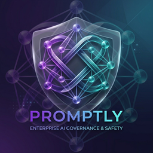
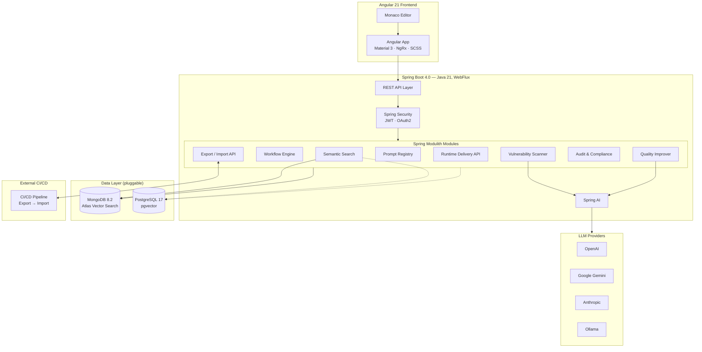
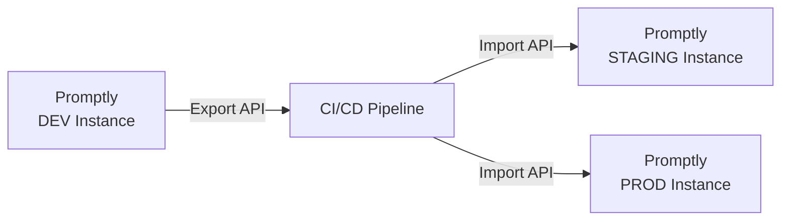

<p align="center">
  
</p>

<h1 align="center">Promptly</h1>

<p align="center">
  <strong>The enterprise AI governance &amp; safety control plane for AI agent prompts.</strong>
</p>

<p align="center">
  <a href="https://github.com/spectrayan/promptly/actions"></a>
  <a href="https://github.com/spectrayan/promptly/blob/main/LICENSE"></a>
  <a href="https://github.com/spectrayan/promptly/releases"></a>
  <a href="https://github.com/spectrayan/promptly/stargazers"></a>
</p>

<p align="center">
  <a href="#-quick-start">Quick Start</a> ·
  <a href="#-features">Features</a> ·
  <a href="#-architecture">Architecture</a> ·
  <a href="#-api-reference">API Reference</a> ·
  <a href="CONTRIBUTING.md">Contributing</a> ·
  <a href="https://github.com/spectrayan/promptly/discussions">Community</a>
</p>

---

## 🎯 What is Promptly?

As organizations adopt multi-agent AI systems, **prompts have become business logic**. Yet there's no centralized, auditable, secure way to manage them — they sprawl across codebases, Notion pages, Slack messages, and random JSON files.

**Promptly closes this gap** by becoming the **control plane for AI behavior**:

> Think: **LaunchDarkly** for feature flags, **Snyk** for security, **GitHub** for versioning — but **for AI prompts**.

| Problem | Promptly Solution |
|---------|------------------|
| Prompts scattered across repos and docs | **Single source of truth** with full CRUD + versioning |
| No approval workflow for prompt changes | **Multi-step governance** — Draft → Review → Approve → Deploy |
| Risk of prompt injection & data exposure | **Automated vulnerability scanning** powered by AI |
| Deploying prompt changes requires code | **Runtime delivery API** — update prompts without redeploying |
| No audit trail for compliance | **Immutable audit log** — SOC2, HIPAA, and regulated industry ready |
| Vendor lock-in | **Self-hostable** — your data stays on your infrastructure |

---

## ✨ Features

### Core Platform

| Module | Description | Status |
|--------|-------------|--------|
| **Prompt Registry** | Full CRUD with versioning, rollback, and diff viewer | ✅ Stable |
| **Workflow Engine** | Multi-step approval state machine (Submit → Review → Approve / Reject) | ✅ Stable |
| **Vulnerability Scanner** | LLM-powered security scanning — auto-triggered on prompt events | ✅ Stable |
| **Quality Improver** | AI-assisted prompt rewriting with generate + apply flow | ✅ Stable |
| **Runtime Delivery** | Low-latency prompt fetch by `appId`, `usecase`, and `agent` | ✅ Stable |
| **Export / Import** | Bulk export/import for CI/CD-driven cross-environment deployment | ✅ Stable |
| **Audit & Compliance** | Central event listener → append-only immutable log | ✅ Stable |
| **Semantic Search** | Embedding-based vector search with duplicate detection | ✅ Stable |
| **Auth & RBAC** | JWT auth, login/register, project membership with role-based access | ✅ Stable |
| **Real-Time Notifications** | SSE-powered notifications with per-user delivery | ✅ Stable |

### Frontend

| Feature | Details |
|---------|---------|
| **Dashboard** | Personalized greeting, project-aware stats, gradient icons |
| **Prompt Management** | List, detail, full-page Monaco editor with AI assist, version diff |
| **Workflow UI** | Workflow list and detail pages |
| **Vulnerability Scanner** | Scan results viewer with severity breakdown |
| **Semantic Search** | Natural language search page |
| **Audit Viewer** | Audit log browser with filters |
| **App Shell** | Material 3 dark/light toggle, GCP-style project selector, collapsible sidebar |

---

## 🏗️ Architecture

Promptly is built as a **modular monolith** using Spring Modulith with a reactive API layer and event-driven module communication.



### Design Principles

| Principle | Implementation |
|-----------|---------------|
| **API-First** | OpenAPI spec → generated Java interfaces + multi-language SDKs |
| **Hexagonal / Ports & Adapters** | Domain core is pure POJOs — no framework annotations |
| **DDD Bounded Contexts** | Each module owns its aggregate root and domain events |
| **Event-Driven Integration** | Modules communicate via `@ApplicationModuleListener` events only |
| **Reactive End-to-End** | WebFlux + Reactive MongoDB / R2DBC for non-blocking I/O |
| **Pluggable Persistence** | Database adapters activated via Maven profiles + Spring properties |

---

## 🛠️ Tech Stack

| Layer | Technology |
|-------|------------|
| **Frontend** | Angular 21 · TypeScript 5.9 · Angular Material 21 · NgRx · SCSS |
| **Prompt Editor** | Monaco Editor (ngx-monaco-editor-v2) |
| **Backend** | Java 21 · Spring Boot 4.0 · Spring Framework 7 · WebFlux |
| **AI / LLM** | Spring AI (multi-provider: OpenAI, Gemini, Anthropic, Ollama) |
| **Modularity** | Spring Modulith (module boundaries, event-driven, ArchUnit verification) |
| **Database** | MongoDB 8.2 (default) · PostgreSQL 17 + pgvector (pluggable) |
| **Search** | MongoDB Atlas Vector Search / pgvector (semantic search + duplicate detection) |
| **Auth** | JWT · Dual-mode (LOCAL / OIDC) · Spring Security Reactive |
| **API Spec** | OpenAPI 3 · openapi-generator for Java + TypeScript + Python codegen |
| **Build** | Nx 22 monorepo · Maven (backend) · pnpm (frontend) |
| **CI/CD** | GitHub Actions · Docker · Docker Compose |
| **Testing** | JUnit 5 · Testcontainers · Vitest · Playwright |

---

## 🚀 Quick Start

### Prerequisites

| Tool | Version |
|------|---------|
| Java | 21+ (JDK) |
| Node.js | 22+ |
| pnpm | 10+ |
| Maven | 3.9+ |
| Docker | Latest |

### 1. Clone & Install

```bash
git clone https://github.com/spectrayan/promptly.git
cd promptly
pnpm install
```

### 2. Start a Database

<details>
<summary><strong>Option A: MongoDB (default)</strong></summary>

```bash
# Start MongoDB Atlas Local (with vector search support)
docker compose up -d

# Seed the database
docker exec -i promptly-mongodb mongosh promptly < seed-data/mongodb/init.js
```

</details>

<details>
<summary><strong>Option B: PostgreSQL + pgvector</strong></summary>

```bash
# Start PostgreSQL 17 with pgvector extension
docker compose -f docker-compose.postgres.yml up -d

# Flyway migrations run automatically on first boot — no manual seeding needed.
```

</details>

### 3. Generate API Code

```bash
# Generate Java interfaces + Angular/TypeScript/Python SDKs from OpenAPI spec
pnpm run build:openapi
```

### 4. Run the Platform

```bash
# Start both backend and frontend concurrently
pnpm run start:all
```

Or run them individually:

```bash
# Backend — MongoDB (default profile)
pnpm run start:backend

# Backend — PostgreSQL
SPRING_PROFILES_ACTIVE=postgres mvn spring-boot:run -Ppersistence-postgres -f apps/backend/core/pom.xml

# Frontend (Angular on :4200)
pnpm run start:frontend
```

### 5. Open the App

| Service | URL |
|---------|-----|
| **Frontend** | [http://localhost:4200](http://localhost:4200) |
| **Backend API** | [http://localhost:8080](http://localhost:8080) |
| **Swagger UI** | [http://localhost:8080/swagger-ui.html](http://localhost:8080/swagger-ui.html) |

---

## 🐳 Production Deployment

```bash
# Build and run the full production stack
docker compose -f docker-compose.prod.yml up -d
```

### Environment Variables

| Variable | Description | Default |
|----------|-------------|---------|
| `PROMPTLY_PERSISTENCE_TYPE` | Database backend (`mongo` or `postgres`) | `mongo` |
| `PROMPTLY_LLM_API_KEY` | API key for the configured LLM provider | — |
| `PROMPTLY_LLM_PROVIDER` | LLM provider (`openai`, `anthropic`, `gemini`, `ollama`) | `gemini` |
| `PROMPTLY_LLM_MODEL` | Model name | `gemini-2.5-flash` |
| `PROMPTLY_DEPLOYMENT_MODE` | `saas` or `self-hosted` | `self-hosted` |
| `R2DBC_URL` | R2DBC connection URL (PostgreSQL only) | `r2dbc:postgresql://localhost:5432/promptly` |
| `DB_USER` | Database username (PostgreSQL only) | `promptly` |
| `DB_PASSWORD` | Database password (PostgreSQL only) | `promptly` |

### Database Switching

| Database | Maven Profile | Spring Profile | Docker Compose |
|----------|--------------|----------------|----------------|
| MongoDB | `persistence-mongo` (default) | *(none / default)* | `docker-compose.yml` |
| PostgreSQL | `persistence-postgres` | `postgres` | `docker-compose.postgres.yml` |

```bash
# Build & test with PostgreSQL adapters + Testcontainers
mvn clean verify -Ppersistence-postgres -f apps/backend/core/pom.xml
```

---

## 🔌 CI/CD Integration

Promptly treats each instance as a **single-environment deployment**. Promotion across environments is handled by **external CI/CD pipelines** using the Export and Import APIs:



| API | Method | Endpoint | Description |
|-----|--------|----------|-------------|
| **Export** | `GET` | `/api/v1/prompts/export` | Export prompts as a portable JSON bundle |
| **Import** | `POST` | `/api/v1/prompts/import` | Import a prompt bundle into the target instance |

This keeps Promptly stateless with respect to environments and lets teams use their existing deployment tooling (GitHub Actions, GitLab CI, Jenkins, etc.).

---

## 📡 API Reference

Full interactive docs are available at **`/swagger-ui.html`** when the backend is running.

### Prompt Registry

| Method | Endpoint | Description |
|--------|----------|-------------|
| `POST` | `/api/v1/prompts` | Create a new prompt |
| `GET` | `/api/v1/prompts` | List prompts (filtered, paginated) |
| `GET` | `/api/v1/prompts/{id}` | Get prompt detail |
| `PUT` | `/api/v1/prompts/{id}` | Update prompt (creates new version) |
| `POST` | `/api/v1/prompts/{id}/rollback/{v}` | Rollback to a specific version |

### Workflow & Approvals

| Method | Endpoint | Description |
|--------|----------|-------------|
| `POST` | `/api/v1/prompts/{id}/submit-review` | Submit prompt for review |
| `POST` | `/api/v1/workflows/{id}/approve` | Approve a workflow step |
| `POST` | `/api/v1/workflows/{id}/reject` | Reject a workflow step |

### AI-Powered Features

| Method | Endpoint | Description |
|--------|----------|-------------|
| `POST` | `/api/v1/prompts/{id}/scan` | Trigger vulnerability scan |
| `POST` | `/api/v1/prompts/{id}/improve` | Generate AI improvement |
| `GET` | `/api/v1/search?q=...` | Semantic search |

### Runtime Delivery

| Method | Endpoint | Description |
|--------|----------|-------------|
| `GET` | `/api/v1/deliver?appId=X&usecase=Y&agent=Z` | Fetch prompt for AI agents |

---

## 📦 SDKs & Libraries

Promptly auto-generates client SDKs from the OpenAPI specification. Use these to integrate your AI agents or services:

| SDK | Package | Install |
|-----|---------|---------|
| **Angular** | [`@promptly/client`](libs/shared/sdks/v1/angular/promptly-client) | `npm install @promptly/client` |
| **TypeScript (Fetch)** | [`@promptly/query`](libs/shared/sdks/v1/query/typescript/promptly-query) | `npm install @promptly/query` |
| **Python** | [`promptly-query`](libs/shared/sdks/v1/query/python/promptly-query) | `pip install promptly-query` |
| **Java (Spring WebClient)** | [`com.promptly:promptly-query`](libs/shared/sdks/v1/query/java-spring/promptly-query) | Maven / Gradle (see [README](libs/shared/sdks/v1/query/java-spring/promptly-query/README.md)) |

> 💡 See each SDK's README for detailed usage, configuration, and examples.

---

## 📁 Monorepo Structure

```
promptly/                              # Nx monorepo root
├── apps/
│   ├── backend/
│   │   └── core/                      # Spring Boot 4 application
│   │       ├── pom.xml
│   │       └── src/main/java/com/promptly/
│   │           ├── shared/            # @ApplicationModule(OPEN) — configs, base classes
│   │           ├── auth/              # JWT auth, user management
│   │           ├── project/           # Multi-project RBAC
│   │           ├── prompt/            # Prompt Registry (aggregate root)
│   │           ├── workflow/          # Approval state machine
│   │           ├── scanner/           # LLM vulnerability scanning
│   │           ├── improver/          # AI prompt improvement
│   │           ├── delivery/          # Runtime prompt delivery
│   │           ├── audit/             # Immutable audit trail
│   │           └── search/            # Semantic vector search
│   ├── frontend/
│   │   └── web/promptly/             # Angular 21 application
│   │       └── src/app/
│   │           ├── core/              # Auth, guards, interceptors
│   │           ├── shared/            # Reusable UI components
│   │           ├── features/          # Dashboard, prompts, workflows, scanner, audit, search
│   │           └── layout/            # Shell, header, sidebar
│   └── e2e/                           # Playwright end-to-end tests
├── libs/
│   └── shared/
│       ├── apis/                      # Generated Java API interfaces
│       ├── sdks/                      # Generated Angular + TypeScript + Python + Java SDKs
│       ├── openapi-spec/              # OpenAPI YAML specification (single source of truth)
│       └── mock-assets/               # Mock data for frontend dev
├── seed-data/                         # MongoDB seed scripts
├── docs/                              # Architecture docs, ADRs, logo
├── infra/                             # Kubernetes & deployment manifests
├── scripts/                           # Build & utility scripts
├── nx.json                            # Nx workspace config
├── pom.xml                            # Parent Maven POM
├── package.json                       # Node/pnpm workspace
├── docker-compose.yml                 # Dev (MongoDB Atlas Local)
├── docker-compose.postgres.yml        # Dev (PostgreSQL + pgvector)
└── docker-compose.prod.yml            # Production stack
```

---

## 🤝 Contributing

We welcome contributions of all kinds — bug reports, feature requests, documentation improvements, and code! Please see our **[Contributing Guide](CONTRIBUTING.md)** for full details.

```bash
# Quick start for contributors
git clone https://github.com/<your-username>/promptly.git
cd promptly
pnpm install
docker compose up -d
pnpm run build:openapi
pnpm run start:all
```

1. Fork the repository
2. Create a feature branch (`git checkout -b feat/amazing-feature`)
3. Commit your changes (`git commit -m 'feat: add amazing feature'`)
4. Push to the branch (`git push origin feat/amazing-feature`)
5. Open a Pull Request

---

## 🌐 Community

- 🐛 [Report a Bug](https://github.com/spectrayan/promptly/issues/new?template=bug_report.md)
- 💡 [Request a Feature](https://github.com/spectrayan/promptly/issues/new?template=feature_request.md)
- 💬 [Discussions](https://github.com/spectrayan/promptly/discussions)
- 📧 [developer@spectrayan.com](mailto:developer@spectrayan.com)
- 🔒 [Security Policy](SECURITY.md)

---

## 📄 License

This project is licensed under the **Apache License 2.0** — see the [LICENSE](LICENSE) file for details.

---

<p align="center">
  Built with ❤️ by <a href="https://github.com/spectrayan">Spectrayan</a>
</p>
