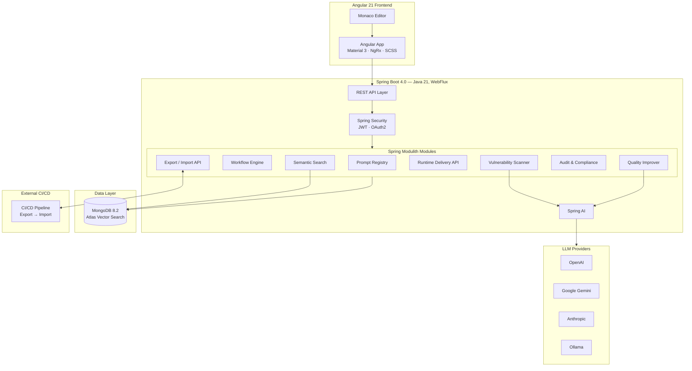
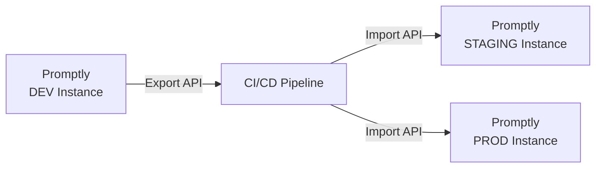

# Promptly

**The enterprise AI governance and safety control plane for AI agent prompts.**

Promptly gives organizations full control over their AI behavior — with versioning, workflow approvals, vulnerability scanning, AI-assisted quality improvement, runtime delivery, and immutable audit compliance built in.

> Think: **LaunchDarkly** for feature flags, **Snyk** for security, **GitHub** for versioning — but for AI prompts.

---

## Why Promptly?

As organizations adopt multi-agent AI systems, prompts have become **business logic**. Yet there's no centralized, auditable, secure way to manage them. Prompts sprawl across codebases, Notion pages, Slack messages, and random JSON files.

Promptly closes this gap by becoming the **control plane for AI behavior**:

- **No more prompt sprawl** — single source of truth for all prompts across teams and agents
- **Governance & approvals** — Draft → Review → Approve → Deploy with RBAC and workflow controls
- **Security by default** — automated vulnerability scanning for prompt injection, PHI/PII exposure, and missing guardrails
- **Business-user empowerment** — update prompts without code changes or redeployments
- **Immutable audit trail** — full compliance readiness for SOC2, HIPAA, and regulated industries
- **Self-hostable** — run it on your own infrastructure, your data never leaves your network

---

## Architecture

Promptly is built as a **modular monolith** using Spring Modulith with a reactive API layer and event-driven module communication.



### Design Principles

| Principle | Implementation |
|-----------|---------------|
| **API-First** | OpenAPI spec → generated Java interfaces + Angular SDK |
| **Hexagonal / Ports & Adapters** | Domain core is pure POJOs — no framework annotations |
| **DDD Bounded Contexts** | Each module owns its aggregate root and domain events |
| **Event-Driven Integration** | Modules communicate via `@ApplicationModuleListener` events only |
| **Reactive End-to-End** | WebFlux + Reactive MongoDB driver for non-blocking I/O |

---

## Tech Stack

| Layer | Technology |
|-------|------------|
| **Frontend** | Angular 21 · TypeScript 5.9 · Angular Material 21 · NgRx · SCSS |
| **Prompt Editor** | Monaco Editor (ngx-monaco-editor-v2) |
| **Backend** | Java 21 · Spring Boot 4.0 · Spring Framework 7 · WebFlux |
| **AI/LLM** | Spring AI (multi-provider: OpenAI, Gemini, Anthropic, Ollama) |
| **Modularity** | Spring Modulith (module boundaries, event-driven, ArchUnit verification) |
| **Database** | MongoDB 8.2 (Atlas Local for dev, Atlas for prod) |
| **Search** | MongoDB Atlas Vector Search (semantic search + duplicate detection) |
| **Auth** | JWT · Dual-mode (LOCAL / OIDC) · Spring Security Reactive |
| **API Spec** | OpenAPI 3 · openapi-generator for Java + TypeScript codegen |
| **Build** | Nx 22 monorepo · Maven (backend) · pnpm (frontend) |
| **Containers** | Docker · Docker Compose |

---

## Core Modules

### ✅ Built & Functional

| Module | Description |
|--------|-------------|
| **Prompt Registry** | Full CRUD with versioning, rollback, and diff viewer |
| **Workflow Engine** | Multi-step approval state machine (Submit → Review → Approve / Reject) |
| **Vulnerability Scanner** | LLM-powered security scanning — auto-triggered on prompt events via Spring AI |
| **Quality Improver** | AI-assisted prompt rewriting with generate + apply flow |
| **Runtime Delivery API** | Low-latency prompt fetch by `appId`, `usecase`, and `agent` for AI agent integration |
| **Export / Import API** | Bulk export and import of prompts for CI/CD-driven deployment across environments |
| **Audit & Compliance** | Central event listener consuming all domain events → append-only immutable log |
| **Semantic Search** | Embedding-based vector search with similar prompt discovery and duplicate detection |
| **Auth & RBAC** | JWT auth, login/register, project membership with role-based access (Viewer → Admin) |
| **Project Management** | Multi-project workspace with CRUD, membership, and authorization |

### Frontend Features

| Feature | Details |
|---------|---------|
| **Dashboard** | Personalized greeting, project-aware stats, gradient icons |
| **Prompt Management** | List, detail, full-page editor with AI assist, version diff viewer |

| **Workflow UI** | Workflow list and detail pages |
| **Scanner UI** | Scan results viewer |
| **Search** | Semantic search page |
| **Audit Viewer** | Audit log browser |
| **Shell** | M3 Material dark/light toggle, GCP-style project selector, collapsible sidebar |

---

## CI/CD Integration

Promptly treats each instance as a **single-environment deployment**. Promotion across environments (dev → staging → prod) is handled by **external CI/CD pipelines** using the Export and Import APIs:



| API | Method | Endpoint | Description |
|-----|--------|----------|-------------|
| **Export** | `GET` | `/api/v1/prompts/export` | Export prompts as a portable bundle (JSON) |
| **Import** | `POST` | `/api/v1/prompts/import` | Import a prompt bundle into the target instance |

This approach keeps Promptly stateless with respect to environments and lets teams use their existing deployment tooling (GitHub Actions, GitLab CI, Jenkins, etc.).

---

## Monorepo Structure

```
promptly/                              # Nx monorepo root
├── apps/
│   ├── backend/
│   │   └── core/                      # Spring Boot 4 application
│   │       ├── pom.xml
│   │       └── src/main/java/com/promptly/
│   │           ├── shared/            # @ApplicationModule(OPEN) — configs, base classes
│   │           ├── auth/              # JWT auth, user management
│   │           ├── project/           # Multi-project RBAC
│   │           ├── prompt/            # Prompt Registry (aggregate root)
│   │           ├── workflow/          # Approval state machine
│   │           ├── scanner/           # LLM vulnerability scanning
│   │           ├── improver/          # AI prompt improvement
│   │           ├── delivery/          # Runtime prompt delivery
│   │           ├── audit/             # Immutable audit trail
│   │           └── search/            # Semantic vector search
│   └── frontend/
│       └── web/                       # Angular 21 application
│           └── src/app/
│               ├── core/              # Auth, guards, interceptors
│               ├── shared/            # Reusable UI components
│               ├── features/          # Dashboard, prompts, workflows, scanner, audit, search
│               └── layout/            # Shell, header, sidebar
├── libs/
│   └── shared/
│       ├── apis/                      # Generated Java API interfaces
│       ├── sdks/                      # Generated Angular SDK
│       ├── openapi-spec/              # OpenAPI YAML specification
│       └── mock-assets/              # Mock data for frontend dev
├── seed-data/                         # MongoDB seed scripts
├── docs/architecture/                 # ADRs and design documents
├── nx.json                            # Nx workspace config
├── pom.xml                            # Parent Maven POM
├── package.json                       # Node/pnpm workspace
├── docker-compose.yml                 # Dev (MongoDB Atlas Local)
└── docker-compose.prod.yml            # Production stack
```

---

## Getting Started

### Prerequisites

- **Java 21+** (JDK)
- **Node.js 22+** and **pnpm 10+**
- **Docker** and **Docker Compose**
- **Maven 3.9+**

### 1. Clone & Install

```bash
git clone https://github.com/spectrayan/promptly.git
cd promptly
pnpm install
```

### 2. Start Infrastructure

```bash
# Start MongoDB Atlas Local (with vector search support)
pnpm run docker:up
```

### 3. Seed the Database

```bash
docker exec -i promptly-mongodb mongosh promptly < seed-data/mongodb/init.js
```

### 4. Generate API Code

```bash
# Generate Java interfaces + Angular SDK from OpenAPI spec
pnpm run build:openapi
```

### 5. Run the Platform

```bash
# Start both backend and frontend concurrently
pnpm run start:all
```

Or run them individually:

```bash
# Backend (Spring Boot on :8080)
pnpm run start:backend

# Frontend (Angular on :4200)
pnpm run start:frontend
```

### 6. Access the Application

| Service | URL |
|---------|-----|
| **Frontend** | [http://localhost:4200](http://localhost:4200) |
| **Backend API** | [http://localhost:8080](http://localhost:8080) |
| **API Docs (Swagger)** | [http://localhost:8080/swagger-ui.html](http://localhost:8080/swagger-ui.html) |

### Production Deployment

```bash
# Build and run the full production stack
docker compose -f docker-compose.prod.yml up -d
```

Configure via environment variables:

| Variable | Description | Default |
|----------|-------------|---------|
| `PROMPTLY_LLM_API_KEY` | API key for the configured LLM provider | — |
| `PROMPTLY_LLM_PROVIDER` | LLM provider (`openai`, `anthropic`, `gemini`, `ollama`) | `gemini` |
| `PROMPTLY_LLM_MODEL` | Model name | `gemini-2.5-flash` |
| `PROMPTLY_DEPLOYMENT_MODE` | `saas` or `self-hosted` | `self-hosted` |

---

## Key API Endpoints

### Prompt Registry
| Method | Endpoint | Description |
|--------|----------|-------------|
| `POST` | `/api/v1/prompts` | Create prompt |
| `GET` | `/api/v1/prompts` | List prompts (filtered, paginated) |
| `GET` | `/api/v1/prompts/{id}` | Get prompt detail |
| `PUT` | `/api/v1/prompts/{id}` | Update prompt (creates new version) |
| `POST` | `/api/v1/prompts/{id}/rollback/{v}` | Rollback to version |

### Workflow & Approvals
| Method | Endpoint | Description |
|--------|----------|-------------|
| `POST` | `/api/v1/prompts/{id}/submit-review` | Submit for review |
| `POST` | `/api/v1/workflows/{id}/approve` | Approve workflow step |
| `POST` | `/api/v1/workflows/{id}/reject` | Reject workflow step |

### AI-Powered Features
| Method | Endpoint | Description |
|--------|----------|-------------|
| `POST` | `/api/v1/prompts/{id}/scan` | Trigger vulnerability scan |
| `POST` | `/api/v1/prompts/{id}/improve` | Generate AI improvement |
| `GET` | `/api/v1/search?q=...` | Semantic search |

### Runtime Delivery
| Method | Endpoint | Description |
|--------|----------|-------------|
| `GET` | `/api/v1/deliver?appId=X&usecase=Y&agent=Z` | Fetch prompt for AI agents |

### Export / Import (CI/CD)
| Method | Endpoint | Description |
|--------|----------|-------------|
| `GET` | `/api/v1/prompts/export` | Export prompts as a portable JSON bundle |
| `POST` | `/api/v1/prompts/import` | Import a prompt bundle into this instance |

---

## Contributing

We welcome contributions of all kinds — bug reports, feature requests, documentation improvements, and code. Please see our [CONTRIBUTING.md](CONTRIBUTING.md) for guidelines.

1. Fork the repository
2. Create a feature branch (`git checkout -b feature/amazing-feature`)
3. Commit your changes (`git commit -m 'feat: add amazing feature'`)
4. Push to the branch (`git push origin feature/amazing-feature`)
5. Open a Pull Request

---

## Community

- 🐛 [Report a Bug](https://github.com/spectrayan/promptly/issues/new?template=bug_report.md)
- 💡 [Request a Feature](https://github.com/spectrayan/promptly/issues/new?template=feature_request.md)
- 💬 [Discussions](https://github.com/spectrayan/promptly/discussions)

---

## License

This project is licensed under the **Apache License 2.0** — see the [LICENSE](LICENSE) file for details.
