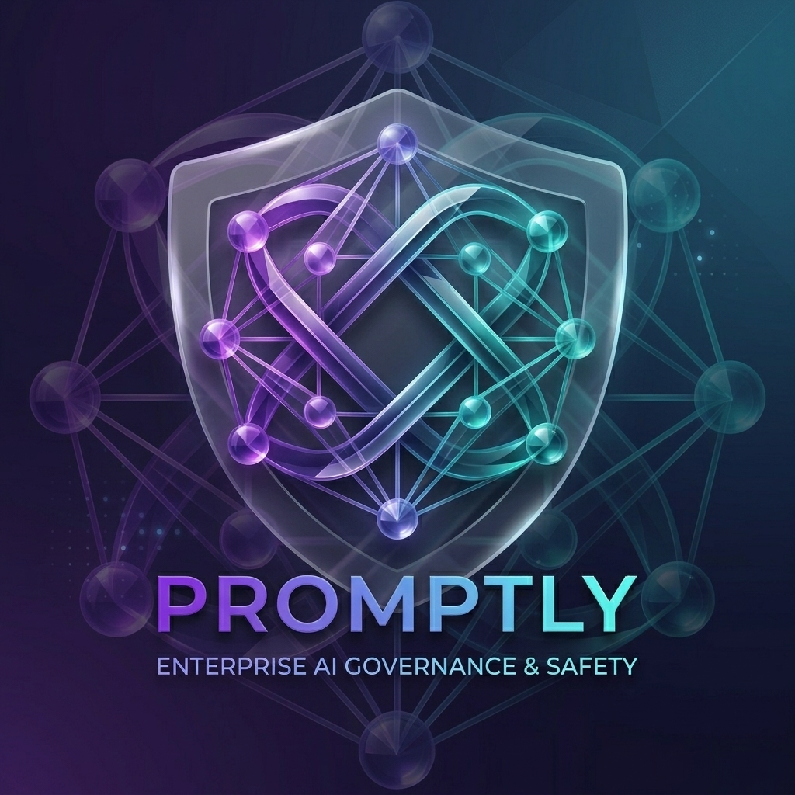

<p align="center">
  
</p>

<h1 align="center">Promptly — Frontend</h1>

<p align="center">
  <strong>Angular 21 web application for the Promptly AI governance platform.</strong>
</p>

<p align="center">
  
  
  
  
</p>

---

## Overview

This is the **Angular 21** frontend for [Promptly](../../../../../../README.md) — the enterprise AI prompt governance platform. It provides a full-featured UI for managing AI prompts, workflows, vulnerability scans, semantic search, audit logs, and more.

### Key Technologies

| Technology | Purpose |
|-----------|---------|
| **Angular 21** | Component framework (standalone components, signals, new control flow) |
| **Angular Material 21** | Material 3 design system with dark/light theme |
| **NgRx 21** | Centralized state management (store, effects, entity) |
| **Monaco Editor** | In-browser prompt editing with syntax highlighting |
| **SCSS** | Themeable styling with CSS custom properties |
| **`@promptly/client`** | Auto-generated API client SDK from OpenAPI spec |
| **`@spectrayan/ng-sse-client`** | Real-time SSE notifications |

---

## Getting Started

### Prerequisites

- **Node.js 22+**
- **pnpm 10+**
- A running [Promptly backend](../../backend/core) on `:8080`

### Install Dependencies

From the **monorepo root**:

```bash
pnpm install
```

### Start the Dev Server

```bash
# From monorepo root (recommended)
pnpm run start:frontend

# Or from this directory
npx ng serve
```

The app will be available at **[http://localhost:4200](http://localhost:4200)** and will auto-reload on file changes.

### Build for Production

```bash
npx ng build --configuration=production
```

Build artifacts are output to `dist/`.

---

## Project Structure

```
src/
├── app/
│   ├── core/                # Auth service, guards, interceptors, SSE client
│   ├── shared/              # Reusable components, pipes, directives
│   ├── features/            # Feature modules
│   │   ├── dashboard/       # Personalized landing page
│   │   ├── prompts/         # Prompt list, detail, editor, version diff
│   │   ├── workflows/       # Approval workflow management
│   │   ├── scanner/         # Vulnerability scan list + detail report
│   │   │   ├── scan-results.page.*      # Scan list with status filters & type chips
│   │   │   └── scan-result-detail.page.* # Severity-grouped findings, Fix-in-Editor
│   │   ├── search/          # Semantic search UI
│   │   └── audit/           # Audit log viewer
│   └── layout/              # Shell, header, sidebar, notifications
├── assets/                  # Static assets
├── environments/            # Environment configurations
└── styles/                  # Global SCSS, theme tokens
```

---

## Testing

### Unit Tests

```bash
npx ng test
```

Runs with [Vitest](https://vitest.dev/).

### End-to-End Tests

```bash
# From monorepo root
npx playwright test
```

E2E tests are located in `apps/e2e/` and use [Playwright](https://playwright.dev/).

---

## Architecture Notes

- **Facade pattern** — each feature has a facade that mediates between components and the NgRx store
- **Hybrid state management** — NgRx for complex async state, Angular Signals for local/simple state
- **API-first** — all HTTP calls go through the generated `@promptly/client` SDK; never use `HttpClient` directly
- **Material 3 theming** — a single `theme.scss` drives the entire design system with CSS custom properties

---

## Related Documentation

- [Main README](../../../../../../README.md) — full platform overview
- [Architecture Docs](../../../../../../docs/architecture) — ADRs and design decisions
- [Contributing Guide](../../../../../../CONTRIBUTING.md) — coding standards and PR process

---

<p align="center">
  Part of the <a href="https://github.com/spectrayan/promptly">Promptly</a> platform · Built with ❤️ by <a href="https://github.com/spectrayan">Spectrayan</a>
</p>
