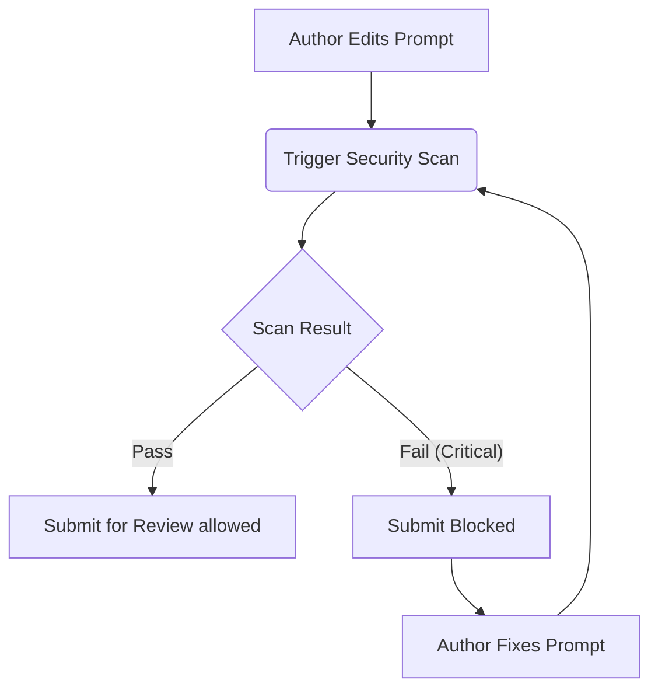

# Security & Vulnerability Scanning

Promptly is built with enterprise AI safety in mind. LLMs are powerful, but they are also susceptible to malicious inputs and hallucinated outputs.

## The Security Scanner

Every time a prompt is edited or created, it is automatically passed through the Promptly Security Scanner (powered by Spring AI). 

The scanner performs static analysis and AI-driven checks on the prompt content.

### Checks Performed

1. **Prompt Injection Detection:** The scanner looks for patterns that indicate the prompt is vulnerable to injection attacks (e.g., missing `<input>` boundary tags, or lack of strong system instructions).
2. **PII Leakage Prevention:** The scanner ensures that the prompt instructions explicitly forbid the LLM from outputting Personally Identifiable Information (PII) like social security numbers or credit cards.
3. **Toxicity & Bias:** Checks if the prompt instructions could inadvertently steer the model towards toxic, biased, or harmful responses.

### Handling Security Alerts

If the scanner detects an issue, the prompt will be flagged in the UI. 
* **Warnings:** Non-critical issues that serve as recommendations. You can still submit the prompt for review.
* **Critical Vulnerabilities:** Serious issues that *block* the prompt from being submitted. You must resolve these issues before the workflow can proceed.

This ensures that vulnerable prompts never even make it to the peer-review stage, drastically reducing the risk of a security incident in production.
