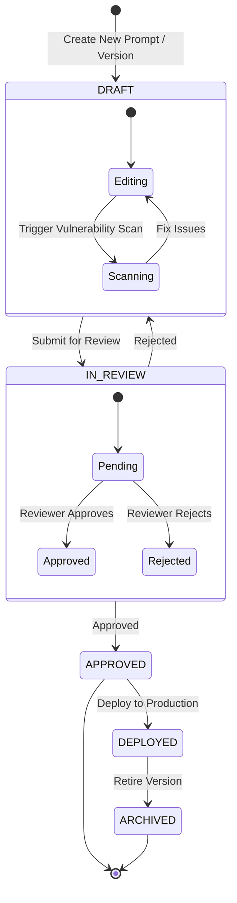
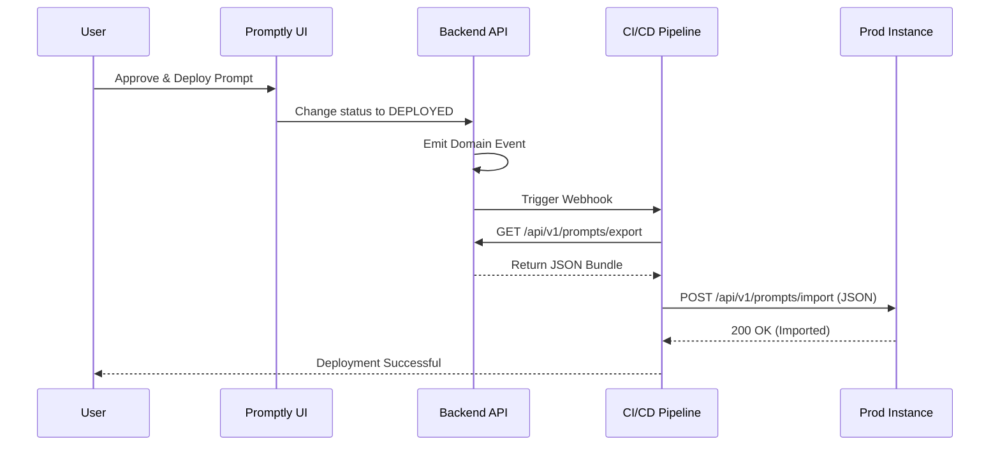

# Prompt Workflows & Approvals

Promptly provides a robust Workflow Engine that enforces governance and peer review for all AI prompts before they can be deployed to production. This ensures that no prompt goes live without proper vulnerability scanning, quality checks, and human oversight.

## The Approval State Machine

Every prompt version in Promptly goes through a lifecycle state machine. 

## Workflow Roles & Permissions

Promptly integrates with your Project's RBAC (Role-Based Access Control) to determine who can transition prompts between states.

| Role | Capabilities in Workflow |
|------|---------------------------|
| **Viewer** | Can view deployed prompts and audit logs. Cannot edit or submit workflows. |
| **Editor** | Can create drafts, edit prompts, run vulnerability scans, and submit for review. |
| **Reviewer** | All Editor permissions + Can Approve or Reject prompts in `IN_REVIEW` state. |
| **Admin** | All Reviewer permissions + Can bypass workflow, force deploy, and manage project settings. |

## Step-by-Step Process

### 1. Draft Phase
When a user creates a new prompt or edits an existing one, a new version is created in the `DRAFT` state. 
*   **AI Quality Improvement:** Use the "AI Improve" button to automatically refine the prompt for clarity and safety.
*   **Vulnerability Scanning:** Before submission, a security scan is run in the background (powered by Spring AI) to check for prompt injection risks, PII leaks, and missing system guardrails.

### 2. Review Phase
Once the prompt is ready, the author clicks **Submit for Review**.
*   The state changes to `IN_REVIEW`.
*   Reviewers receive a notification (via the Notification Bell and SSE stream).
*   Reviewers can see a rich **Diff Viewer** comparing the new version against the currently deployed version to understand exactly what changed.

### 3. Approval & Deployment
A Reviewer reviews the prompt.
*   **If Approved:** The prompt enters the `APPROVED` state. It is now eligible for deployment.
*   **If Rejected:** The prompt is sent back to `DRAFT` with comments for the author to fix.
*   Once `APPROVED`, the prompt can be deployed. It is instantly available via the **Runtime Delivery API**.

## Automated CI/CD Export Pipeline

Approved prompts can be automatically synchronized across environments.

This workflow ensures that the development Promptly instance acts as the source of truth, while production instances remain strictly read-only and synchronized via standard GitOps practices.
