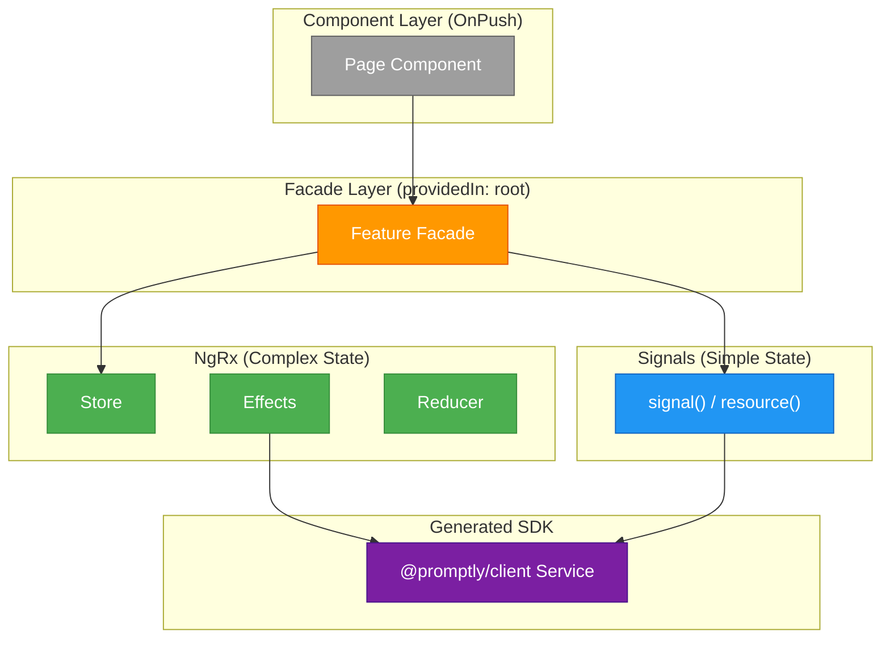

# ADR-001: Hybrid State Management Architecture

**Status:** Accepted  
**Date:** 2026-04-23  
**Authors:** Spectrayan Team

---

## Context

Promptly's Angular 21 frontend needs a state management strategy that balances architectural consistency with pragmatic simplicity. The backend exposes 12 bounded contexts via a contract-first OpenAPI SDK (`@promptly/client`).

We evaluated two approaches:
1. **Full NgRx everywhere** — consistent but heavy; 6 files per feature slice × 10 features = 60 state management files
2. **No state management** — lightweight but quickly becomes unmanageable with cross-feature state sharing, SSE streams, and optimistic updates

## Decision

**Hybrid approach:** Use **NgRx** where shared/complex state justifies the ceremony, and **Angular Signals + `resource()`** for simple read-only features. The **Facade pattern is mandatory for all features**, providing a consistent API surface regardless of the underlying state implementation.

### Layer Architecture

### Rules

1. **Components** are pure presentation — no `inject(PromptsService)`, no business logic, only facade access
2. **Facades** are `@Injectable({ providedIn: 'root' })` — the single API surface for components
3. **Facades expose Angular Signals** (via `selectSignal()` for NgRx, or raw `signal()` for lightweight)
4. **Components use `ChangeDetectionStrategy.OnPush`** — signals guarantee efficient rendering
5. **Effects are the ONLY layer** that calls generated SDK services (for NgRx features)
6. **Facade methods are the ONLY layer** that calls SDK services (for signal-based features)

### Feature Classification

| Feature | State Strategy | Rationale |
|---------|---------------|-----------|
| **Prompts** | NgRx | Shared state (dashboard, workflows, scanner all reference prompts). Full CRUD with optimistic updates. |
| **Workflows** | NgRx | State machine transitions (PENDING → APPROVED/REJECTED). Cross-references prompts. |
| **Dashboard** | NgRx | Dedicated backend endpoint. Aggregates metrics from multiple domains. |
| **Projects** | NgRx | Referenced by every project-scoped feature. Project selection drives global navigation. |
| **Auth** | NgRx | Session state shared across guards, interceptors, and nav. |
| **Notifications** | NgRx | SSE push updates, cross-feature snackbar triggers. |
| **Scanner** | Signal + resource | Triggered from prompt detail page. Results are prompt-scoped, not shared. |
| **Audit** | Signal + resource | Read-only list with SSE append. No cross-feature sharing. |
| **Search** | Signal + resource | Stateless query→results. No caching needed. |
| **Improver** | Signal + resource | One-shot improve action scoped to a single prompt. |

### Migration Path

If a signal-based feature grows complex enough to warrant NgRx:
1. Add the 6 NgRx files (state, actions, effects, reducer, selectors)
2. Update the facade internals to delegate to the store instead of direct SDK calls
3. **Zero component changes required** — the facade interface stays identical

## Consequences

### Positive
- ~50% fewer state management files vs. full NgRx
- Simple features remain simple (3 files: component + facade + template)
- Consistent API surface for all components via facades
- Easy to graduate features from signals → NgRx when complexity demands it

### Negative
- Two state patterns to understand (minor — both are behind facades)
- Code review must enforce "which pattern for this feature?" decisions

## References

- [Angular Signals](https://angular.dev/guide/signals) — Angular 21 stable signal API
- [Angular resource()](https://angular.dev/guide/signals/resource) — Async data loading with signals
