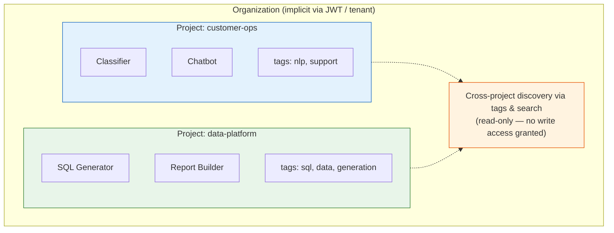
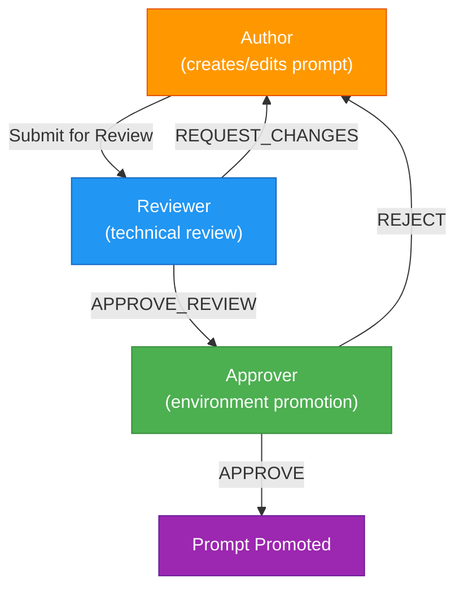
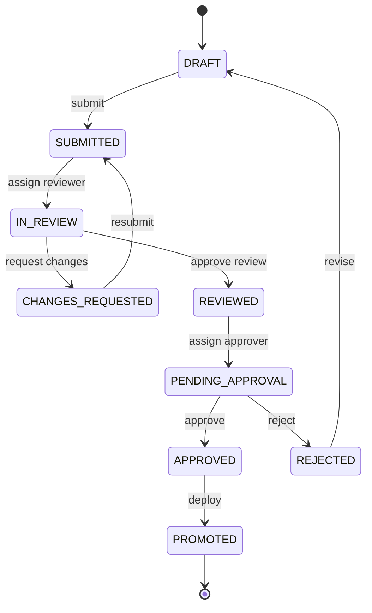
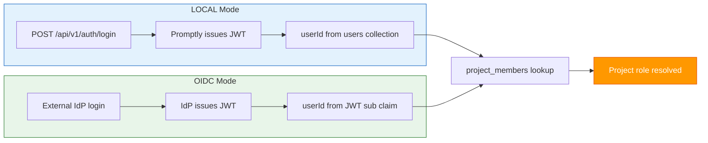

# ADR-002: Project Organization & Role-Based Access Control

**Status:** Accepted  
**Date:** 2026-04-23  
**Authors:** Spectrayan Team  

---

## Context

Promptly is an enterprise AI prompt governance platform. Organizations using it may have dozens of teams, hundreds of prompts across multiple products, and strict compliance requirements around who can modify and promote prompts to production.

We need a model that answers:
1. **How are prompts organized?** (Flat list? Nested hierarchy?)
2. **Who can do what?** (Create, edit, review, approve, delete)
3. **How do teams discover and reuse prompts across boundaries?**

## Decision

### 1. Organization Model: Projects + Tags

**Projects** are the primary organizational and security boundary.  
**Tags** provide flexible cross-project discovery without granting authority.



#### Why Not Sub-groups?

We evaluated three options:

| Option | Pros | Cons |
|--------|------|------|
| **A. Flat projects** | Simple | No sub-organization |
| **B. Projects + Tags** ✅ | Flexible, flat RBAC, multi-label | Tags need governance |
| **C. Org → Project → Sub-group** | Full hierarchy | Cascading RBAC, over-engineered |

**Tags solve the organizational problem better than rigid trees** because:
- A prompt can belong to multiple categories simultaneously (`["billing", "support", "high-priority"]`)
- No deep nesting = simpler RBAC (one lookup: "what's this user's role in this project?")
- Cross-team discovery is a search/filter concern, not a hierarchy concern

### 2. Role Model: Business-Oriented Roles

Since Promptly is primarily a **business governance tool** (not a developer tool), roles reflect the actual workflow participants in enterprise AI governance:

#### Roles

| Role | Description | Target Persona |
|------|-------------|---------------|
| **Viewer** | Read-only access to prompts, versions, scan results | Stakeholders, auditors, cross-team users |
| **Author** | Create, edit, version prompts. Submit for review | Prompt engineers, data scientists, product managers |
| **Reviewer** | Review prompt quality, safety, and correctness. Can request changes | Senior engineers, peer reviewers, QA |
| **Approver** | Approve or reject environment promotions (the gate to production) | Team leads, compliance officers, business owners |
| **Admin** | Full access including member management and project settings | Project owners, engineering managers |

#### Why Separate Reviewer and Approver?

In regulated industries (healthcare, finance, government), **separation of duties** is a compliance requirement:

- The person who **reviews technical quality** should not be the same person who **approves for production**
- This maps to SOC 2, HIPAA, and SOX audit requirements
- Smaller teams can assign both roles to the same person — the model supports it without enforcing it

#### Permission Matrix

| Action | Viewer | Author | Reviewer | Approver | Admin |
|--------|:------:|:------:|:--------:|:--------:|:-----:|
| View prompts, versions, scans | ✅ | ✅ | ✅ | ✅ | ✅ |
| Create / edit prompts | — | ✅ | — | — | ✅ |
| Submit for review | — | ✅ | — | — | ✅ |
| Review & request changes | — | — | ✅ | ✅ | ✅ |
| Approve / reject promotions | — | — | — | ✅ | ✅ |
| Trigger security scans | — | ✅ | ✅ | ✅ | ✅ |
| Delete prompts | — | — | — | — | ✅ |
| Manage project members | — | — | — | — | ✅ |
| Manage project settings | — | — | — | — | ✅ |

> **Note:** Reviewers cannot edit prompts. This is intentional — it prevents reviewers from modifying what they're reviewing (separation of concerns).

### 3. Approval Workflow



#### Workflow States



### 4. Cross-Team Discovery

Tags enable **read-only discovery** across project boundaries:

| Action | Own Project | Cross-Project (via tags/search) |
|--------|:-----------:|:------------------------------:|
| View prompt content | ✅ (by role) | ✅ (all authenticated users) |
| View version history | ✅ (by role) | ✅ |
| View scan results | ✅ (by role) | ✅ |
| Edit / approve | ✅ (by role) | ❌ |
| **Fork to own project** | N/A | ✅ |

**Fork** creates a copy of the prompt in the user's own project. The new copy is independent — the user becomes the Author and their project's RBAC applies.

### 5. Authentication Strategy: Built-in + Pluggable OIDC

Promptly supports **two authentication modes**, configurable at deployment time:

| Mode | When to use | User management | Config |
|------|------------|----------------|--------|
| **LOCAL** (built-in) | Development, testing, small teams, demos | Built-in `users` collection | `promptly.auth.provider=local` |
| **OIDC** (external) | Production, enterprise | Keycloak / Okta / Azure AD | `promptly.auth.provider=oidc` |

#### LOCAL Mode (Default)

Promptly manages users internally with a simple `users` collection:

- Users created/managed through Promptly's own UI and API
- Passwords hashed with bcrypt
- Session via JWT issued by Promptly itself
- **Ideal for:** getting started, testing, small teams, on-prem deployments

#### OIDC Mode (Enterprise)

Promptly delegates authentication to an external Identity Provider:

- Spring Security OAuth2 Resource Server validates JWTs
- User identity extracted from JWT claims (`sub`, `email`, `name`)
- No `users` collection needed — identity comes from the IdP
- Project membership still stored in Promptly's `project_members`
- **Ideal for:** enterprise deployments with existing Keycloak/Okta/Azure AD

#### Configuration

```yaml
# application.yml
promptly:
  auth:
    provider: local                          # local | oidc

# OIDC mode settings (only when provider=oidc)
spring:
  security:
    oauth2:
      resourceserver:
        jwt:
          issuer-uri: https://keycloak.example.com/realms/promptly
```

#### How User Resolution Works



### 6. Data Model

#### Users (LOCAL mode only)

```
users {
  id: string (PK)
  email: string (unique)
  displayName: string
  passwordHash: string (bcrypt)
  avatarUrl: string | null
  orgRole: ORG_ADMIN | ORG_USER          // platform-level role
  status: ACTIVE | INACTIVE
  lastLoginAt: Instant | null
  createdAt: Instant
  updatedAt: Instant
}
```

> In OIDC mode, this collection is unused. User identity comes from the JWT.

#### Project

```
projects {
  id: string (PK)
  name: string
  description: string
  slug: string (unique, URL-friendly)
  visibility: PUBLIC | INTERNAL | PRIVATE
  settings: {
    requireReviewBeforeApproval: boolean (default: true)
    requireScanBeforePromotion: boolean (default: true)
    allowedEnvironments: string[]
  }
  createdBy: string
  createdAt: Instant
  updatedAt: Instant
}
```

#### Project Membership

```
project_members {
  id: string (PK)
  projectId: string (FK → projects)
  userId: string                        // from users._id (local) or JWT sub (oidc)
  email: string                         // denormalized for display
  displayName: string                   // denormalized for display
  role: VIEWER | AUTHOR | REVIEWER | APPROVER | ADMIN
  addedBy: string
  addedAt: Instant
}
```

#### Prompt (existing, no change)

```
prompts {
  id: string (PK)
  projectId: string (FK → projects)  // already exists
  tags: string[]                      // already exists
  ...
}
```

#### Workflow (minor additions)

```
workflows {
  ...existing fields...
  steps: [
    {
      stage: REVIEW | APPROVAL
      assignedTo: string (userId)
      role: REVIEWER | APPROVER
      action: APPROVE | REJECT | REQUEST_CHANGES
      comment: string
      actedAt: Instant
    }
  ]
}
```

### 7. Project Visibility

| Visibility | Who can discover & view |
|-----------|----------------------|
| **PUBLIC** | All authenticated users in the org |
| **INTERNAL** | All users (default — enables cross-team discovery) |
| **PRIVATE** | Only project members |

### 8. Auth API (LOCAL Mode)

| Method | Path | Description |
|--------|------|-------------|
| `POST` | `/api/v1/auth/register` | Create a new user (ORG_ADMIN only or self-signup) |
| `POST` | `/api/v1/auth/login` | Login → returns JWT |
| `POST` | `/api/v1/auth/refresh` | Refresh JWT |
| `GET` | `/api/v1/auth/me` | Get current user profile |
| `GET` | `/api/v1/users` | List users (for project member search) |

> These endpoints are **disabled** in OIDC mode. The frontend redirects to the external IdP login page instead.

### 9. Future Considerations

- **Org-Level Policies**: Global rules like "all PRODUCTION promotions require Trust & Safety team approval" — injected as an extra workflow step automatically.
- **Role Inheritance**: Not needed now. If introduced, keep it one level: Approver inherits Reviewer permissions.
- **API Keys per Project**: For programmatic access (CI/CD prompt delivery), scoped to project.
- **SCIM Provisioning**: Auto-sync users and project memberships from external IdP groups.

## Consequences

### Positive
- Simple, flat RBAC — one lookup per request ("what's this user's role in this project?")
- Business-oriented roles match how enterprises actually govern AI content
- Tags enable organic discovery without complex permission cascading
- Separation of Reviewer/Approver satisfies compliance requirements

### Negative
- Tags need governance (recommended: project admins manage the tag taxonomy)
- Fork creates copies, not references — no automatic syncing between forked prompts
- No cascading inheritance — if a user needs access to 10 projects, they need 10 memberships

### Risks
- Tag sprawl: Mitigate with a curated tag taxonomy per org
- Role confusion: Mitigate with clear in-app documentation and role descriptions
