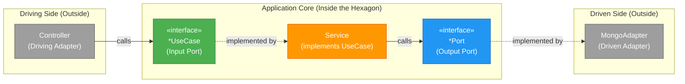

# ADR-003: Hexagonal Architecture — Port & Service Naming Conventions

**Status**: Accepted  
**Date**: 2026-04-26  
**Deciders**: Architecture Team

---

## Context

Promptly follows **Hexagonal Architecture** (Ports & Adapters) with **Domain-Driven Design** for its backend modules. As the number of modules grows (Prompt, Workflow, Auth, Project, Notification, LlmConfig, Scanner, Improver, Search, Delivery, Audit), consistent naming across ports, services, and adapters is critical for:

- Developer onboarding and code discoverability
- Making dependency direction visible at a glance
- Enforcing architectural boundaries via convention

This document codifies the naming conventions for all layers of the hexagonal architecture.

---

## Decision

### 1. Input Ports — Suffix: `UseCase`

**Location**: `{module}/application/port/in/`

Input ports define **what the application can do** — they are the inbound contract that driving adapters (controllers, CLI, scheduled jobs) call *into* the application core.

```
CreatePromptUseCase
ApproveWorkflowUseCase
ResolveLlmConfigUseCase
```

**Why `UseCase`?**

- **Self-documenting intent**: A developer browsing the `port/in/` package sees a catalog of business capabilities — essentially a use case diagram in code.
- **DDD alignment**: The application layer speaks the language of the domain, not the language of infrastructure.
- **Granularity enforcement**: Each interface should represent exactly **one use case** (one business action). The `UseCase` suffix reinforces this — it would feel wrong to name a 9-method interface `NotificationUseCase` because that's clearly *multiple* use cases.

**Rules**:
- One use case = one interface = one business action
- Each interface should contain **1–3 methods** at most (e.g., a query use case might have `getById` + `listAll`)
- Command objects for mutations should be nested records inside the interface:
  ```java
  public interface CreatePromptUseCase {
      Mono<Prompt> createPrompt(CreatePromptCommand command);

      record CreatePromptCommand(String name, String description, ...) {}
  }
  ```

### 2. Output Ports — Suffix: `Port`

**Location**: `{module}/application/port/out/`

Output ports define **what the application needs** from the outside world — persistence, external APIs, messaging, third-party services. They are the outbound contract that the application core calls, and infrastructure adapters implement.

```
PromptPersistencePort
LlmImproverPort
EmbeddingPort
VectorSearchPort
```

**Why `Port`?**

- **Technology-agnostic**: The application says "I need prompt storage" without caring if it's MongoDB, PostgreSQL, or an in-memory map. The word "Port" (from Alistair Cockburn's original hexagonal architecture paper) signifies a **plug point** where any adapter can connect.
- **No implementation leakage**: The term "Repository" implies a specific DDD pattern and is heavily associated with Spring Data — both are implementation details. Output ports in the application layer must not leak infrastructure vocabulary.

**Rules**:
- Persistence ports: use `{Aggregate}PersistencePort` (e.g., `PromptPersistencePort`)
- External service ports: use descriptive names with `Port` suffix (e.g., `LlmImproverPort`, `EmbeddingPort`)
- **Never** name an output port `*Repository` — that term belongs only in the infrastructure adapter layer

### 3. Why Different Suffixes?

The different suffixes encode the **direction of dependency**, which is the core principle of hexagonal architecture:



| Aspect              | `*UseCase` (Input Port)            | `*Port` (Output Port)                |
|----------------------|------------------------------------|--------------------------------------|
| **Who implements?**  | Application service (inside core)  | Infrastructure adapter (outside core)|
| **Who calls it?**    | Driving adapter (controller)       | Application service                  |
| **Direction**        | Outside → In                       | Inside → Out                         |
| **Mental model**     | "What can I do?"                   | "What do I need?"                    |
| **DDD alignment**    | Maps to use case diagram           | Maps to integration point            |

When you see `*UseCase` in code, you immediately know the dependency flows **inward**. When you see `*Port`, you know it flows **outward**. This eliminates ambiguity in code reviews and makes architectural violations easy to spot.

### 4. Application Services — Suffix: `Service`

**Location**: `{module}/application/service/`

Each application service implements **exactly one** input port (use case interface). The service name should mirror the use case it implements:

```
CreatePromptService      → implements CreatePromptUseCase
UpdatePromptService      → implements UpdatePromptUseCase
RollbackPromptService    → implements RollbackPromptUseCase
```

**Rules**:
- One service class = one use case interface (**no God Services**)
- Services orchestrate domain logic — they must not contain business rules themselves
- Services depend on output ports (never on concrete adapters)

### 5. Infrastructure Adapters — Suffix: `Adapter`

**Location**: `{module}/infrastructure/persistence/repository/` or `{module}/infrastructure/external/`

Adapters implement output ports and handle the technology-specific translation:

```
PromptMongoAdapter       → implements PromptPersistencePort
OpenAiImproverAdapter    → implements LlmImproverPort
```

**Rules**:
- Adapter names should include the technology: `Mongo`, `Redis`, `OpenAi`, `Vertex`, etc.
- Adapters must never be injected directly — always accessed through their port interface

### 6. Module API — Suffix: `ModuleApi`

**Location**: `{module}/` (package root)

For inter-module communication in Spring Modulith, each module exposes a `ModuleApi` interface. This is the **only** type other modules should reference:

```
PromptModuleApi          → cross-module read/update contract
WorkflowModuleApi        → cross-module workflow operations
```

**Rules**:
- Module APIs should return DTOs or read-only projections — **never** expose domain aggregates
- Module APIs are distinct from use case ports — they serve cross-module needs, not user-facing use cases

---

## Complete Example: Prompt Module

```
prompt/
├── PromptModuleApi.java                          ← Inter-module API
├── PromptCreated.java                            ← Domain event (public)
├── PromptUpdated.java
│
├── application/
│   ├── port/
│   │   ├── in/
│   │   │   ├── CreatePromptUseCase.java          ← Input port (UseCase)
│   │   │   ├── UpdatePromptUseCase.java
│   │   │   ├── GetPromptUseCase.java
│   │   │   ├── DeletePromptUseCase.java
│   │   │   ├── RollbackPromptUseCase.java
│   │   │   └── ClonePromptUseCase.java
│   │   └── out/
│   │       └── PromptPersistencePort.java        ← Output port (Port)
│   │
│   ├── service/
│   │   ├── CreatePromptService.java              ← 1:1 with CreatePromptUseCase
│   │   ├── UpdatePromptService.java
│   │   ├── GetPromptService.java
│   │   ├── DeletePromptService.java
│   │   ├── RollbackPromptService.java
│   │   ├── ClonePromptService.java
│   │   └── PromptApplicationService.java         ← Implements PromptModuleApi
│   │
│   └── listener/
│       └── PromptStatusEventListener.java        ← Reacts to cross-module events
│
├── domain/
│   └── model/
│       ├── Prompt.java                           ← Aggregate root
│       ├── PromptVersion.java                    ← Value object
│       └── PromptSpecifications.java             ← Business rule specifications
│
└── infrastructure/
    ├── persistence/
    │   ├── entity/PromptDocument.java            ← MongoDB document
    │   ├── mapper/PromptPersistenceMapper.java   ← MapStruct domain ↔ document
    │   └── repository/
    │       ├── PromptMongoAdapter.java            ← Implements PromptPersistencePort
    │       └── PromptReactiveMongoRepository.java ← Spring Data interface
    │
    └── web/
        ├── PromptController.java                 ← Driving adapter (REST)
        └── PromptWebMapper.java                  ← Domain → OpenAPI DTO
```

---

## References

- Alistair Cockburn, ["Hexagonal Architecture"](https://alistair.cockburn.us/hexagonal-architecture/) — original "Ports and Adapters" paper
- Tom Hombergs, *Get Your Hands Dirty on Clean Architecture* — Java-specific hexagonal patterns
- Vaughn Vernon, *Implementing Domain-Driven Design* — tactical DDD patterns
- Spring Modulith documentation — inter-module API and event conventions
