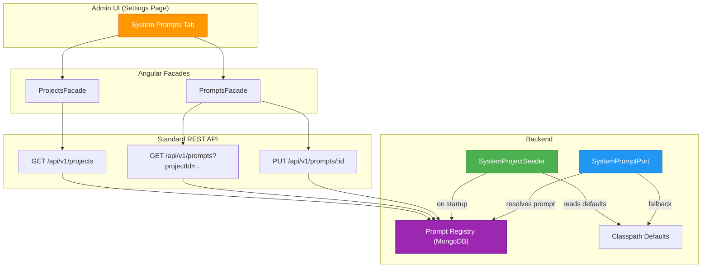
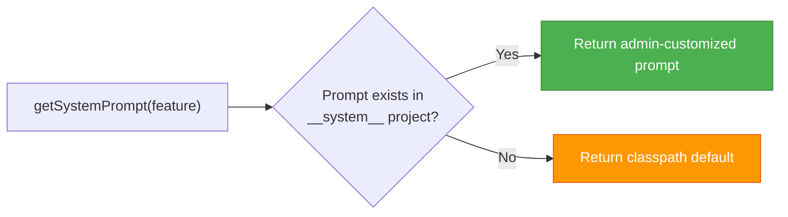

# ADR-005: System Prompt Administration via `__system__` Project

**Status:** Accepted  
**Date:** 2026-04-26  
**Authors:** Spectrayan Team

---

## Context

Promptly's AI features (security scanner, prompt improver) use LLM system prompts to define their behavior. Initially, these prompts were hardcoded in Java adapter classes. This created two problems:

1. **Admins cannot customize AI behavior** without code changes and redeployment
2. **Prompt content is not versioned** — no audit trail of changes to critical AI instructions

We needed a mechanism for administrators to view, edit, version, and reset system prompts without introducing new API endpoints or controller infrastructure.

## Decision

Introduce a **well-known project** named `__system__` in the Prompt Registry. System prompts are stored as regular `Prompt` entities within this project, fully leveraging the existing versioning, RBAC, and audit infrastructure.

### Architecture

### Key Components

| Component | Location | Responsibility |
|-----------|----------|----------------|
| `SystemPromptPort` | `shared/systemprompt/` | Interface for resolving prompts (registry → classpath fallback) |
| `SystemProjectSeeder` | `prompt/application/service/` | Seeds `__system__` project on `ApplicationReadyEvent` |
| `SYSTEM_PROJECT_NAME` | Frontend `system.constants.ts` | Frontend constant mirroring backend's `SYSTEM_PROJECT_ID` |
| `systemPromptName()` | Frontend `system.constants.ts` | Maps feature key → prompt name (e.g., `scanner` → `scanner-system-prompt`) |

### Resolution Precedence

### Seeding Flow

On application startup, `SystemProjectSeeder`:
1. Checks if `__system__` project exists (`existsByName`)
2. If not, creates the project with description and system tags
3. For each AI feature, reads the classpath default and creates a `Prompt` entity
4. Prompts start as `DRAFT`, get an initial version, then are marked `APPROVED`

### Why No Dedicated System Prompt API?

We evaluated adding a `SystemPromptController` but rejected it because:
- The standard `PromptsApi` already supports all needed operations (list, get, update, rollback)
- The `__system__` project ID is a fixed constant — no discovery endpoint needed beyond `GET /projects`
- Adding a parallel API creates maintenance burden and consistency risk

## Consequences

### Positive
- Zero new REST endpoints — reuses existing prompt infrastructure
- Full versioning and audit trail for system prompt changes
- Admin can reset to defaults via rollback to version 1
- Classpath defaults ensure the system works with zero configuration

### Negative
- `__system__` project appears in the project list (mitigated by filtering in UI)
- Seeder runs on every startup (idempotent — skips if project exists)
