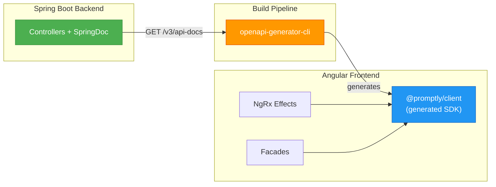

# ADR-006: Contract-First API Design with OpenAPI Codegen

**Status:** Accepted  
**Date:** 2026-04-26  
**Authors:** Spectrayan Team

---

## Context

Promptly is a full-stack monorepo with a Spring Boot 4 (WebFlux) backend and an Angular 21 frontend. The frontend needs a typed HTTP client for every API endpoint. Manual client creation is error-prone and drifts from the actual API contract over time.

We needed a strategy that:
1. Guarantees frontend and backend stay in sync
2. Eliminates manual DTO creation on the frontend
3. Generates fully typed Angular services with RxJS `Observable` return types

## Decision

Adopt a **contract-first** approach using OpenAPI 3.1 specification and code generation.

### Pipeline



### Generated SDK Structure

```
libs/shared/sdks/v1/angular/promptly-client/
├── api/                      # Generated service classes
│   ├── prompts.service.ts    # PromptsService
│   ├── projects.service.ts   # ProjectsService
│   ├── workflows.service.ts  # WorkflowsService
│   └── ...
├── model/                    # Generated DTOs
│   ├── prompt-response.model.ts
│   ├── create-prompt-request.model.ts
│   └── ...
└── index.ts                  # Barrel exports
```

### Import Convention

The SDK is published as an Nx library with the `@promptly/client` import path:

```typescript
import { PromptsService, PromptResponse, CreatePromptRequest } from '@promptly/client';
```

### Rules

1. **Never import from relative paths** into the generated SDK — always use `@promptly/client`
2. **Never manually edit** generated files — re-run the generator instead
3. **Only Effects and Facades** may inject generated services (see ADR-001)
4. **Components never import** from `@promptly/client` directly

## Consequences

### Positive
- Single source of truth: backend annotations → OpenAPI spec → typed frontend client
- Zero manual DTO maintenance on the frontend
- Type-safe API calls with compile-time checking
- IDE autocompletion for all API methods and response shapes

### Negative
- Generator output can be verbose (mitigated by tree-shaking in production build)
- Regeneration required after backend API changes (mitigated by CI pipeline)
