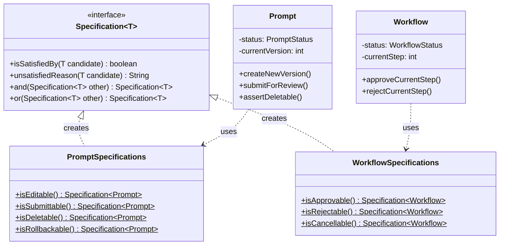

# ADR-007: Specification Pattern for Domain Business Rules

**Status:** Accepted  
**Date:** 2026-04-26  
**Authors:** Spectrayan Team

---

## Context

Domain aggregates (`Prompt`, `Workflow`) enforce business rules on state transitions — e.g., a prompt can only be submitted for review if it's in `DRAFT` status and has at least one version. Initially, these checks were scattered as inline `if` statements inside aggregate methods, making them hard to test, compose, or reuse.

We needed a pattern that:
1. Makes business rules explicit, named, and testable in isolation
2. Provides clear error messages when a rule is violated
3. Supports composition (AND/OR of multiple rules)

## Decision

Implement the **Specification pattern** with a generic `Specification<T>` interface in the shared domain layer.

### Class Hierarchy



### Usage in Aggregates

Aggregates delegate rule checking to specifications via a private `assertSatisfies` method:

```java
public void submitForReview() {
    assertSatisfies(PromptSpecifications.isSubmittable(),
            "Cannot submit for review");
    this.status = PromptStatus.IN_REVIEW;
}

// Aggregates also expose read-only query methods:
public boolean isEditable() {
    return PromptSpecifications.isEditable().isSatisfiedBy(this);
}
```

### Rule Definitions

| Aggregate | Specification | Rule |
|-----------|--------------|------|
| `Prompt` | `isEditable()` | Status is NOT `IN_REVIEW` |
| `Prompt` | `isSubmittable()` | Status is `DRAFT` AND `currentVersion >= 1` |
| `Prompt` | `isDeletable()` | Status is NOT `IN_REVIEW` AND NOT `APPROVED` |
| `Prompt` | `isRollbackable()` | `currentVersion > 1` |
| `Workflow` | `isApprovable()` | Status is `PENDING` AND has pending steps |
| `Workflow` | `isRejectable()` | Status is `PENDING` AND has pending steps |
| `Workflow` | `isCancellable()` | Status is NOT in a terminal state |

### Why Not Inline Conditionals?

| Approach | Testability | Reusability | Error Messages |
|----------|:-----------:|:-----------:|:--------------:|
| Inline `if` statements | ❌ Coupled to aggregate | ❌ Duplicated | ❌ Ad-hoc strings |
| **Specification pattern** | ✅ Unit-testable independently | ✅ Composable via `and()`/`or()` | ✅ Structured `unsatisfiedReason()` |

## Consequences

### Positive
- Business rules are named, discoverable, and testable without instantiating full aggregates
- `unsatisfiedReason()` produces clear API error messages for clients
- Specifications can be composed: `isEditable().and(isOwnedBy(userId))`
- Query methods (`isEditable()`, `isDeletable()`) enable UI to pre-check actions

### Negative
- Additional abstraction layer — simple rules may feel over-engineered (mitigated by consistency)
- Specification classes must be kept in sync with aggregate state fields
