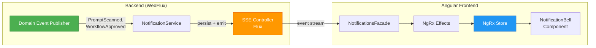

# ADR-009: Real-Time Notifications via Server-Sent Events

**Status:** Accepted  
**Date:** 2026-04-26  
**Authors:** Spectrayan Team

---

## Context

Promptly needs to push real-time updates to the frontend for events like scan completion, workflow approvals, and prompt version changes. We evaluated three transport mechanisms:

| Option | Pros | Cons |
|--------|------|------|
| **A. WebSockets** | Full-duplex, low latency | Complex reconnection, connection state management |
| **B. Polling** | Simple | Wasteful, high latency, no true push |
| **C. Server-Sent Events (SSE)** | Native browser support, auto-reconnect, HTTP/2 multiplexing | Unidirectional (server→client only) |

## Decision

Use **Server-Sent Events (SSE)** over HTTP/2 for real-time notifications. SSE provides server→client push, which is the only direction needed for notifications. The browser's `EventSource` API handles reconnection automatically.

### Event Flow Architecture

### Event Types

| Event | Source Module | Payload |
|-------|-------------|---------|
| `PROMPT_CREATED` | Prompt | `{ promptId, projectId, author }` |
| `PROMPT_UPDATED` | Prompt | `{ promptId, version, author }` |
| `SCAN_COMPLETED` | Scanner | `{ scanId, promptId, severity, findings }` |
| `WORKFLOW_SUBMITTED` | Workflow | `{ workflowId, promptId, submitter }` |
| `WORKFLOW_APPROVED` | Workflow | `{ workflowId, promptId, approver }` |
| `WORKFLOW_REJECTED` | Workflow | `{ workflowId, promptId, rejector, reason }` |

### Frontend NgRx Integration

Notifications use **NgRx** (not signals) because:
- SSE events trigger cross-feature side effects (snackbar, badge count, list refresh)
- Multiple components observe notification state (bell icon, settings page, toast overlay)
- NgRx Effects handle SSE stream lifecycle (connect, reconnect, disconnect on logout)

### Why Not WebSockets?

SSE was chosen over WebSockets because:
1. Promptly only needs server→client push — no client→server messaging needed
2. `EventSource` auto-reconnects with exponential backoff (built into the browser)
3. HTTP/2 multiplexes SSE streams over a single TCP connection
4. WebFlux natively supports `Flux<ServerSentEvent<T>>` — zero additional dependencies

## Consequences

### Positive
- Zero dependency on WebSocket libraries
- Browser handles reconnection automatically
- HTTP/2 multiplexing — no dedicated connection management
- Natural fit with WebFlux `Flux<ServerSentEvent>`

### Negative
- Unidirectional only — if bidirectional messaging is needed later, WebSockets would be required
- `EventSource` API has no built-in header support (workaround: use `fetch()` with `ReadableStream`)
