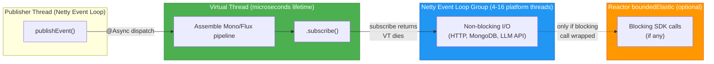

# ADR-010: Virtual Threads as Async Event Dispatch Trampolines

**Status:** Accepted  
**Date:** 2026-05-10  
**Authors:** Spectrayan Team

---

## Context

Promptly uses Spring WebFlux (Netty) for non-blocking request handling and Spring Modulith for inter-module event propagation. Several event listeners (`ScanOnPromptUpdatedListener`, `EmbeddingOnPromptUpdatedListener`, `AuditAspect`) are annotated with `@Async` to decouple them from the publishing module's reactive chain.

Before this decision, `@EnableAsync` was declared but **no custom executor** was configured — Spring defaulted to `SimpleAsyncTaskExecutor`, which creates an unbounded number of platform threads with no reuse and no lifecycle management.

### Questions Evaluated

1. Should we use Java 21 virtual threads for `@Async` tasks?
2. Do virtual threads need idle-timeout or pool-size configuration?
3. How do virtual threads interact with WebFlux's non-blocking event loop?
4. What happens at extreme scale (100k+ req/sec)?

---

## Decision

Use **virtual threads (Project Loom)** as the executor for all `@Async` methods, configured via `VirtualThreadTaskExecutor` and `spring.threads.virtual.enabled: true`.

### Threading Model



### How It Works

In the current reactive codebase, `@Async` listeners follow this pattern:

```java
@Async
@EventListener
void on(PromptCreated event) {
    scanPromptUseCase.scanPrompt(event.aggregateId())   // returns Mono<>
        .doOnError(e -> log.warn("..."))
        .onErrorComplete()
        .subscribe();   // returns instantly — virtual thread ends here
}
```

The virtual thread's sole purpose is to **decouple the publisher from the listener**. Without `@Async`, `publishEvent()` invokes listeners synchronously on the caller's thread (often a Netty event-loop thread). The virtual thread acts as a "trampoline" — it assembles the reactive pipeline, calls `.subscribe()`, and is immediately garbage-collected.

### Why Not Platform Thread Pools?

| Aspect | Platform Thread Pool | Virtual Threads |
|--------|---------------------|-----------------|
| Memory per thread | ~1 MB stack | ~few KB stack |
| Pool sizing | Requires tuning (core, max, queue) | No pool — on-demand creation |
| Idle timeout | Must configure `keep-alive` | N/A — GC'd on completion |
| For this use case | Massive overkill — thread lives microseconds | Perfect — cheapest possible trampoline |

---

## Virtual Threads vs. Reactive: Scale Analysis

### At moderate scale (< 10k req/sec)

Both approaches work fine. Virtual threads would handle blocking I/O transparently. Reactive adds complexity but uses fewer resources.

### At extreme scale (100k req/sec)

If listeners performed **blocking I/O** (no reactive chain):

```java
@Async
void on(PromptCreated event) {
    LlmResult result = llmClient.scanSync(id);   // blocks 2-5 seconds
    dbClient.saveSync(result);                     // blocks 10-50ms
}
```

- Steady-state: **200k–500k concurrent virtual threads** (each waiting on LLM response)
- Memory: ~1–5 GB of virtual thread stacks
- Carrier threads: Not exhausted (blocked virtual threads unmount)
- Bottleneck: Downstream API throughput (not threading)

With the **current reactive approach**:

- Virtual threads: 100k created/sec, each lives microseconds → effectively zero concurrent
- All I/O multiplexed onto 4–16 Netty event-loop threads via non-blocking sockets
- Memory per in-flight request: ~hundreds of bytes (Reactor signal state)
- Built-in backpressure via `flatMap(concurrency)` operators

**Conclusion:** Reactive wins on memory efficiency and backpressure at extreme scale. Virtual threads win on code simplicity. Our hybrid approach (reactive I/O + virtual thread dispatch) gets the best of both.

---

## Configuration

### `application.yml`

```yaml
spring:
  threads:
    virtual:
      enabled: true   # Enable virtual threads for @Async, @Scheduled
```

### `AsyncConfig.java`

```java
@Bean
public Executor taskExecutor() {
    var executor = new VirtualThreadTaskExecutor("promptly-async-");
    return new MdcPropagatingExecutor(executor);  // propagates traceId
}
```

### What `spring.threads.virtual.enabled` Does and Does NOT Affect

| Component | Affected? | Notes |
|-----------|-----------|-------|
| `@Async` methods | ✅ Yes | Uses `VirtualThreadTaskExecutor` bean |
| `@Scheduled` methods | ✅ Yes | Spring auto-configures virtual thread scheduler |
| WebFlux request handling | ❌ No | Netty event loop is unchanged — always platform threads |
| Reactor `Schedulers.boundedElastic()` | ❌ No | Reactor manages its own pool independently |
| MongoDB / R2DBC drivers | ❌ No | Non-blocking by design, use Netty event loop |

---

## Lifecycle and Cleanup

Virtual threads require **no idle-timeout configuration**:

- **Creation:** On-demand when `@Async` method is invoked
- **Completion:** Thread ends when the method returns (after `.subscribe()`)
- **Cleanup:** JVM garbage-collects the thread object
- **Blocking:** If a virtual thread blocks (I/O, lock), it unmounts from the carrier thread — the carrier is reused for other virtual threads
- **Graceful shutdown:** `spring.lifecycle.timeout-per-shutdown-phase: 30s` ensures in-flight tasks complete during application shutdown

---

## Consequences

### Positive

- Lightest possible event dispatch mechanism — microsecond-lived threads
- No pool sizing, tuning, or idle-timeout configuration
- MDC context (traceId) propagated to async listeners for log correlation
- Compatible with reactive and blocking code paths
- Java 21+ is already required (Spring Boot 4)

### Negative

- Virtual threads add no value for the reactive I/O path — they're purely a dispatch mechanism
- If a future listener performs blocking I/O without a reactive wrapper, it will silently work (virtual threads handle it) but bypasses backpressure — should be caught in code review
- Thread dumps show many short-lived `promptly-async-*` threads, which may be noisy during debugging

### Risks

- At extreme scale, if listeners switch from reactive to blocking, memory usage could spike (200k+ virtual thread stacks). Mitigation: enforce reactive patterns via architectural fitness tests and code review
- `synchronized` blocks and `ReentrantLock` can pin virtual threads to carrier threads. Mitigation: current codebase uses no explicit locking in async paths
