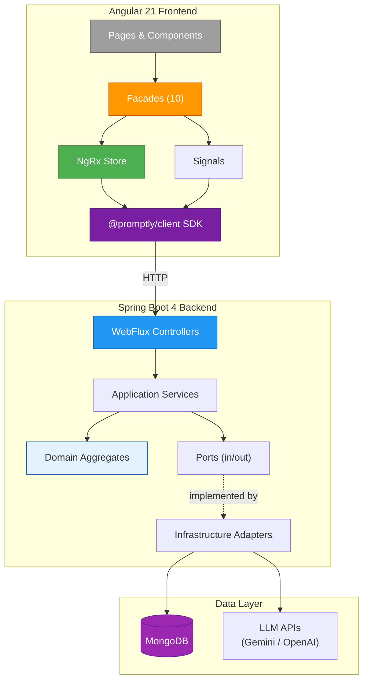

# Architecture Decision Records — Index

**Project:** Promptly  
**Maintained by:** Spectrayan Team

---

This directory contains Architecture Decision Records (ADRs) documenting the
key technical decisions made during the design and implementation of the
Promptly AI Prompt Governance Platform.

## ADR Template Standard

All ADRs follow a consistent format:
- **Authors** are always **"Spectrayan Team"**
- **All diagrams** use Mermaid (no ASCII art)
- **Status** is one of: `Proposed`, `Accepted`, `Deprecated`, `Superseded`

## Index

| # | Title | Status | Key Topic |
|---|-------|--------|-----------|
| [001](001-hybrid-state-management.md) | Hybrid State Management Architecture | Accepted | NgRx vs. Signals, Facade pattern |
| [002](002-project-rbac-model.md) | Project Organization & RBAC | Accepted | Multi-tenant roles, approval workflow |
| [003](003-hexagonal-naming-conventions.md) | Hexagonal Naming Conventions | Accepted | Package structure, DDD layers |
| [004](004-spring-modulith-boundaries.md) | Spring Modulith — Module Boundaries | Accepted | Module dependency map, named interfaces |
| [005](005-system-prompt-administration.md) | System Prompt Administration | Accepted | `__system__` project, seeder pattern |
| [006](006-contract-first-api-design.md) | Contract-First API Design | Accepted | OpenAPI codegen, SDK generation |
| [007](007-specification-pattern.md) | Specification Pattern for Business Rules | Accepted | Domain validation, rule composition |
| [008](008-reactive-persistence.md) | Reactive Persistence with WebFlux & MongoDB | Accepted | Non-blocking I/O, document mapping |
| [009](009-sse-notifications.md) | Real-Time Notifications via SSE | Accepted | Server-Sent Events, NgRx integration |

## High-Level Architecture

