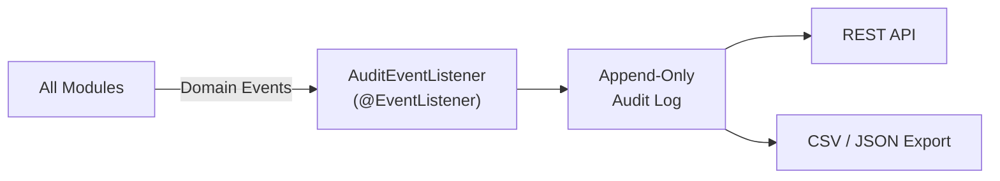

# 📝 Audit & Compliance

The **Audit & Compliance** module provides an immutable, append-only audit trail of every action taken in the platform. It captures domain events from all modules and persists them as audit log entries for compliance reporting, forensic investigation, and governance visibility.

---

## How It Works



1. **Capture** — A generic `@EventListener` consumes all domain events published by any module
2. **Persist** — Each event is mapped to an `AuditEntry` and appended to an immutable log (no updates or deletes)
3. **Query** — The audit log is browsable via the REST API with filters and pagination
4. **Export** — Audit data can be exported for compliance reviews and external reporting

---

## Events Captured

The audit module listens to events from across the entire platform:

| Source Module | Events |
|--------------|--------|
| **Prompt Registry** | `PromptCreated`, `PromptUpdated`, `PromptDeleted` |
| **Workflow Engine** | `PromptSubmittedForReview`, `PromptApproved`, `PromptRejected`, `PromptDeployed` |
| **Scanner** | `ScanCompleted`, `ScanFailed` |
| **Auth** | `UserLoggedIn`, `UserRegistered` |
| **Project** | `ProjectCreated`, `MemberAdded`, `MemberRemoved` |

### Audit Entry Structure

| Field | Type | Description |
|-------|------|-------------|
| `id` | `string` | Unique audit entry ID |
| `eventType` | `string` | Domain event name (e.g., `PromptCreated`) |
| `entityType` | `string` | The type of entity affected (e.g., `PROMPT`, `WORKFLOW`) |
| `entityId` | `string` | ID of the affected entity |
| `projectId` | `string` | Project scope |
| `userId` | `string` | Who performed the action |
| `details` | `object` | Event-specific payload (serialized event data) |
| `timestamp` | `Instant` | When the event occurred |

---

## Immutability Guarantee

Audit entries are **append-only** — there is no update or delete API:

- Entries cannot be modified after creation
- The `AuditAspect` uses AOP to capture events automatically — no manual logging required
- Database-level protections prevent backdoor modifications
- This design satisfies SOC 2, HIPAA, and regulated industry audit requirements

---

## REST API

| Method | Endpoint | Description |
|--------|----------|-------------|
| `GET` | `/api/v1/audit?projectId=X` | List audit entries with filters and pagination |
| `GET` | `/api/v1/audit/export?projectId=X` | Export audit log as downloadable data |

### Query Parameters

| Parameter | Description |
|-----------|-------------|
| `projectId` | Filter by project (required) |
| `eventType` | Filter by event type (e.g., `PromptCreated`) |
| `entityType` | Filter by entity type (e.g., `PROMPT`) |
| `userId` | Filter by actor |
| `from` / `to` | Date range filter |
| `page` / `size` | Pagination |

---

## Architecture

```
audit/
├── domain/
│   └── model/           # AuditEntry (domain aggregate — immutable)
├── application/
│   ├── port/in/         # AuditUseCase (input port — query only)
│   ├── port/out/        # AuditPersistencePort (output port)
│   ├── service/         # AuditApplicationService
│   └── listener/        # AuditEventListener (consumes all domain events)
└── infrastructure/
    ├── web/             # REST controller
    ├── aop/             # AuditAspect (AOP-based event capture)
    └── persistence/     # MongoAdapter, Document, Mapper
```

---

<p align="center">
  Part of the <a href="../README.md">Promptly</a> platform · Built with ❤️ by <a href="https://github.com/spectrayan">Spectrayan</a>
</p>
