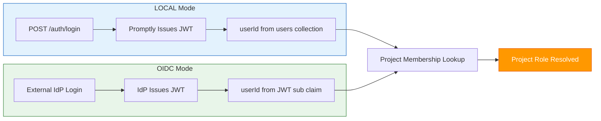

# 🔐 Auth & RBAC

The **Auth & RBAC** module handles authentication and role-based access control for the platform. It supports two modes: **LOCAL** (built-in user management) and **OIDC** (external identity provider), configurable at deployment time.

---

## Authentication Modes



### LOCAL Mode (Default)

- Promptly manages users internally with a `users` collection
- Passwords hashed with bcrypt
- JWT issued by Promptly itself
- **Ideal for:** development, testing, small teams, on-prem deployments

### OIDC Mode (Enterprise)

- Delegates authentication to an external Identity Provider (Keycloak, Okta, Azure AD)
- Spring Security OAuth2 Resource Server validates JWTs
- User identity extracted from JWT claims (`sub`, `email`, `name`)
- Project membership still stored in Promptly
- **Ideal for:** enterprise deployments with existing identity infrastructure

---

## Role-Based Access Control

Promptly uses **project-scoped roles** — a user's role is determined per-project, not globally:

| Role | View | Create/Edit | Review | Approve | Admin |
|------|:----:|:-----------:|:------:|:-------:|:-----:|
| **Viewer** | ✅ | — | — | — | — |
| **Author** | ✅ | ✅ | — | — | — |
| **Reviewer** | ✅ | — | ✅ | — | — |
| **Approver** | ✅ | — | ✅ | ✅ | — |
| **Admin** | ✅ | ✅ | ✅ | ✅ | ✅ |

### Why Separate Reviewer & Approver?

In regulated industries (healthcare, finance, government), **separation of duties** is a compliance requirement:

- The person who reviews technical quality ≠ the person who approves for production
- Maps to SOC 2, HIPAA, and SOX audit requirements
- Smaller teams can assign both roles to the same person

---

## REST API

### Authentication (LOCAL mode only)

| Method | Endpoint | Description |
|--------|----------|-------------|
| `POST` | `/api/v1/auth/register` | Create a new user |
| `POST` | `/api/v1/auth/login` | Login → returns JWT |
| `POST` | `/api/v1/auth/refresh` | Refresh JWT |
| `GET` | `/api/v1/auth/me` | Get current user profile |
| `PATCH` | `/api/v1/auth/me/preferences` | Update user preferences |
| `GET` | `/api/v1/users` | List users (for member search) |

> These endpoints are **disabled** in OIDC mode. The frontend redirects to the external IdP login page instead.

### Project Members

| Method | Endpoint | Description |
|--------|----------|-------------|
| `GET` | `/api/v1/projects/{id}/members` | List project members |
| `POST` | `/api/v1/projects/{id}/members` | Add a member to a project |
| `PUT` | `/api/v1/projects/{id}/members/{memberId}` | Update member role |
| `DELETE` | `/api/v1/projects/{id}/members/{memberId}` | Remove a member |

---

## Configuration

```yaml
# application.yml
promptly:
  auth:
    provider: local           # local | oidc

# OIDC mode (only when provider=oidc)
spring:
  security:
    oauth2:
      resourceserver:
        jwt:
          issuer-uri: https://keycloak.example.com/realms/promptly
```

---

## Architecture

```
auth/
├── domain/
│   └── model/           # User, UserRole (pure POJOs)
├── application/
│   ├── port/in/         # AuthUseCase, UserUseCase (input ports)
│   ├── port/out/        # UserPersistencePort (output port)
│   └── service/         # AuthApplicationService
└── infrastructure/
    ├── web/             # REST controller
    ├── security/        # JWT filter, SecurityConfig
    └── persistence/     # MongoAdapter, Document, Mapper
```

---

<p align="center">
  Part of the <a href="../README.md">Promptly</a> platform · Built with ❤️ by <a href="https://github.com/spectrayan">Spectrayan</a>
</p>
