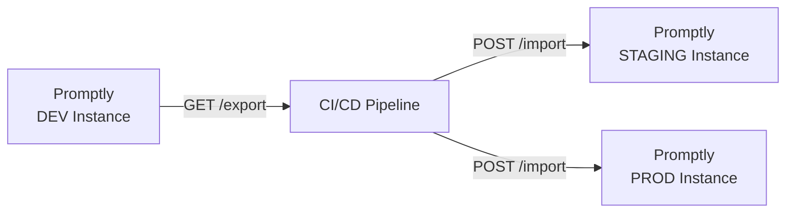

# 📤 Export / Import

The **Export / Import** module enables CI/CD-driven prompt deployment across environments. Promptly treats each instance as a single-environment deployment — promotion from dev → staging → production is handled by external pipelines using these APIs.

---

## How It Works



1. **Export** — The CI/CD pipeline calls the Export API on the source instance to get a portable JSON bundle
2. **Transfer** — The pipeline stores the bundle as an artifact (e.g., in Git, S3, or a registry)
3. **Import** — The pipeline calls the Import API on the target instance(s) to deploy the prompts

---

## Export Formats

### Export a Single Prompt

Export a specific prompt with all its versions, metadata, and latest scan results:

```bash
GET /api/v1/exchange/export/prompts/{id}
```

### Export an Entire Project

Export all prompts in a project as a single bundle:

```bash
GET /api/v1/exchange/export/project/{projectId}
```

### Import a Bundle

Import a previously exported bundle into the target instance:

```bash
POST /api/v1/exchange/import
Content-Type: application/json

{ ... exported bundle ... }
```

---

## REST API

| Method | Endpoint | Description |
|--------|----------|-------------|
| `GET` | `/api/v1/exchange/export/prompts/{id}` | Export a single prompt as a JSON bundle |
| `GET` | `/api/v1/exchange/export/project/{projectId}` | Export all prompts in a project |
| `POST` | `/api/v1/exchange/import` | Import a prompt bundle into this instance |

---

## CI/CD Integration Example

### GitHub Actions

```yaml
name: Promote Prompts to Production
on:
  workflow_dispatch:

jobs:
  promote:
    runs-on: ubuntu-latest
    steps:
      - name: Export from DEV
        run: |
          curl -H "Authorization: Bearer ${{ secrets.DEV_TOKEN }}" \
            "${{ secrets.DEV_URL }}/api/v1/exchange/export/project/my-project" \
            -o prompts.json

      - name: Import to PROD
        run: |
          curl -X POST \
            -H "Authorization: Bearer ${{ secrets.PROD_TOKEN }}" \
            -H "Content-Type: application/json" \
            -d @prompts.json \
            "${{ secrets.PROD_URL }}/api/v1/exchange/import"
```

---

## Architecture

```
exchange/
├── domain/
│   └── model/           # ExchangeBundle (domain aggregate)
├── application/
│   ├── port/in/         # ExchangeUseCase (input port)
│   ├── port/out/        # ExchangePersistencePort
│   └── service/         # ExchangeApplicationService
└── infrastructure/
    ├── web/             # REST controller
    └── persistence/     # MongoAdapter
```

---

<p align="center">
  Part of the <a href="../README.md">Promptly</a> platform · Built with ❤️ by <a href="https://github.com/spectrayan">Spectrayan</a>
</p>
