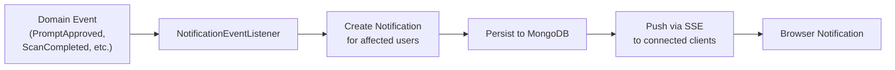

# 🔔 Real-Time Notifications

The **Notifications** module delivers real-time, per-user notifications via Server-Sent Events (SSE). When a domain event occurs (prompt approved, scan completed, etc.), the relevant users receive instant browser notifications without polling.

---

## How It Works



1. **Capture** — `NotificationEventListener` subscribes to domain events from all modules
2. **Target** — For each event, determines which users should be notified (e.g., project members with Reviewer role)
3. **Persist** — Creates a `Notification` document in MongoDB
4. **Push** — Sends the notification via SSE to connected browser clients in real-time
5. **Display** — The Angular frontend receives the SSE event and shows a toast notification + updates the bell icon badge

---

## Notification Types

| Event Source | Notification | Recipients |
|-------------|-------------|------------|
| **Workflow** | Prompt submitted for review | Project Reviewers & Approvers |
| **Workflow** | Prompt approved | Prompt Author |
| **Workflow** | Prompt rejected | Prompt Author |
| **Scanner** | Scan completed (PASS / WARN / FAIL) | Prompt Author |
| **Project** | New member added | All project Admins |

---

## User Preferences

Users can customize their notification experience:

| Setting | Options | Default |
|---------|---------|---------|
| **Email notifications** | On / Off | Off |
| **Browser push** | On / Off | On |
| **Notification types** | Select which event types to receive | All enabled |

### Project-Level Settings

Admins can configure notification behavior per project:

| Setting | Description |
|---------|-------------|
| **Notify on scan completion** | Send notifications when scans finish |
| **Notify on workflow state change** | Send notifications on approve/reject |

---

## REST API

| Method | Endpoint | Description |
|--------|----------|-------------|
| `GET` | `/api/v1/notifications` | List notifications for the current user (paginated) |
| `GET` | `/api/v1/notifications/count` | Get unread notification count |
| `PATCH` | `/api/v1/notifications/{id}` | Mark a notification as read |
| `POST` | `/api/v1/notifications/mark-all-read` | Mark all notifications as read |
| `GET` | `/api/v1/notifications/preferences` | Get user notification preferences |
| `PUT` | `/api/v1/notifications/preferences` | Update user notification preferences |
| `GET` | `/api/v1/notifications/project-settings/{projectId}` | Get project notification settings |
| `PUT` | `/api/v1/notifications/project-settings/{projectId}` | Update project notification settings |

---

## SSE Streaming

The frontend establishes a persistent SSE connection on login:

```typescript
// Angular EventSource connection
const source = new EventSource('/api/v1/notifications/stream', {
  headers: { 'Authorization': `Bearer ${token}` }
});

source.onmessage = (event) => {
  const notification = JSON.parse(event.data);
  this.store.dispatch(notificationReceived({ notification }));
};
```

The SSE endpoint uses Spring WebFlux's `Flux<ServerSentEvent>` for non-blocking, per-user event streaming.

---

## Architecture

```
notification/
├── domain/
│   └── model/           # Notification, NotificationPreference (pure POJOs)
├── application/
│   ├── port/in/         # NotificationUseCase (input port)
│   ├── port/out/        # NotificationPersistencePort (output port)
│   └── service/         # NotificationApplicationService
└── infrastructure/
    ├── web/             # REST controller + SSE endpoint
    ├── delivery/        # NotificationEventListener (consumes domain events)
    └── persistence/     # MongoAdapter, Document, Mapper
```

---

<p align="center">
  Part of the <a href="../README.md">Promptly</a> platform · Built with ❤️ by <a href="https://github.com/spectrayan">Spectrayan</a>
</p>
