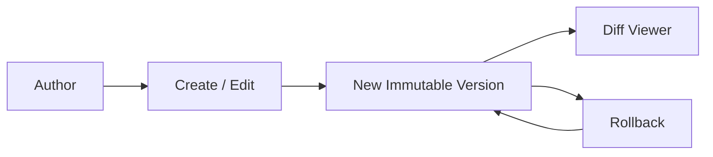

# 📋 Prompt Registry

The **Prompt Registry** is Promptly's core module — the single source of truth for all AI prompt templates. It provides full CRUD with immutable versioning, rollback, and diff viewing.

---

## How It Works



1. **Create** — Authors create prompt templates with a name, content, tags, and model configuration
2. **Version** — Every edit creates a new immutable version (v1, v2, v3…). The previous version is preserved
3. **Diff** — The version diff viewer shows exactly what changed between any two versions
4. **Rollback** — Any previous version can be restored, creating a new version with the old content

---

## Domain Model

Each prompt is an **aggregate root** with the following structure:

| Field | Type | Description |
|-------|------|-------------|
| `id` | `string` | Unique prompt identifier (e.g., `p-health-aba`) |
| `projectId` | `string` | The project this prompt belongs to |
| `name` | `string` | Human-readable display name |
| `description` | `string` | Short summary of what the prompt does |
| `content` | `string` | The prompt text (supports Markdown and Handlebars `{{variables}}`) |
| `tags` | `string[]` | Categorization labels (e.g., `["healthcare", "aba", "autism"]`) |
| `status` | `enum` | `DRAFT` · `IN_REVIEW` · `APPROVED` · `DEPLOYED` · `ARCHIVED` |
| `version` | `int` | Current version number |
| `versions` | `Version[]` | Immutable history of all versions |
| `format` | `enum` | `PLAIN_TEXT` · `MARKDOWN` · `JSON` |
| `createdBy` | `string` | User who created the prompt |
| `createdAt` | `Instant` | Creation timestamp |
| `updatedAt` | `Instant` | Last modification timestamp |

### Version Record

| Field | Type | Description |
|-------|------|-------------|
| `versionNumber` | `int` | Sequential version number |
| `content` | `string` | The prompt content at this version |
| `changeDescription` | `string` | What changed in this version |
| `author` | `string` | Who made the change |
| `createdAt` | `Instant` | When this version was created |

---

## Events Published

The Prompt Registry publishes domain events consumed by other modules:

| Event | Trigger | Consumers |
|-------|---------|-----------|
| `PromptCreated` | New prompt created | Scanner, Search, Audit, Notification |
| `PromptUpdated` | Prompt content edited (new version) | Scanner, Search, Audit, Notification |

These events drive the platform's reactive behavior — when a prompt is created or updated, the scanner automatically triggers a vulnerability scan, the search module updates embeddings, and the audit module records the change.

---

## REST API

| Method | Endpoint | Description |
|--------|----------|-------------|
| `POST` | `/api/v1/prompts` | Create a new prompt |
| `GET` | `/api/v1/prompts` | List prompts (filtered by `projectId`, paginated) |
| `GET` | `/api/v1/prompts/{id}` | Get prompt detail with current content |
| `PUT` | `/api/v1/prompts/{id}` | Update prompt (creates a new version) |
| `DELETE` | `/api/v1/prompts/{id}` | Delete a prompt |
| `GET` | `/api/v1/prompts/{id}/versions` | List all versions for a prompt |
| `GET` | `/api/v1/prompts/{id}/versions/{versionNumber}` | Get a specific version |
| `POST` | `/api/v1/prompts/{id}/rollback/{versionNumber}` | Rollback to a specific version |

---

## Architecture

The Prompt Registry follows the hexagonal (ports & adapters) pattern:

```
prompt/
├── domain/
│   └── model/           # Prompt, PromptVersion (pure POJOs)
├── application/
│   ├── port/in/         # PromptUseCase (input port interface)
│   ├── port/out/        # PromptPersistencePort (output port interface)
│   ├── service/         # PromptApplicationService (orchestration)
│   └── listener/        # PromptStatusEventListener
└── infrastructure/
    ├── web/             # REST controller (delegates to generated API interface)
    └── persistence/     # MongoAdapter, Document, Mapper
```

---

<p align="center">
  Part of the <a href="../README.md">Promptly</a> platform · Built with ❤️ by <a href="https://github.com/spectrayan">Spectrayan</a>
</p>
