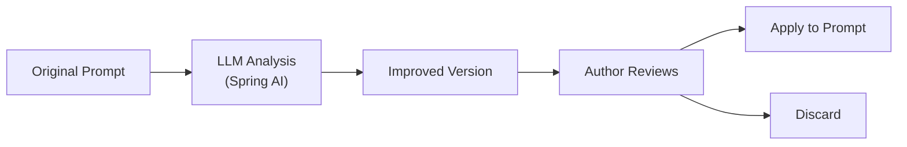

# ✨ Quality Improver

The **Quality Improver** uses AI-assisted rewriting to help authors refine, strengthen, and optimize their prompts. It provides a **generate + apply** flow powered by Spring AI.

---

## How It Works



1. **Generate** — The author clicks "Improve" on a prompt. The current content is sent to the configured LLM with a quality-improvement system prompt
2. **Review** — The LLM returns an improved version. The author compares the original with the suggestion side-by-side
3. **Apply** — If satisfied, the author applies the improvement, creating a new prompt version
4. **Discard** — If not satisfied, the suggestion is discarded. No changes are made

---

## Improvement Categories

The improver evaluates and enhances prompts across several dimensions:

| Dimension | What the AI Improves |
|-----------|---------------------|
| **Clarity** | Ambiguous instructions → precise, unambiguous language |
| **Structure** | Unformatted text → well-organized sections with headers and boundaries |
| **Safety** | Missing guardrails → explicit refusal instructions and role boundaries |
| **Specificity** | Vague expectations → concrete output format, tone, and constraints |
| **Completeness** | Missing context → added system identity, scope definition, and edge cases |

---

## Generate from Idea

In addition to improving existing prompts, the Quality Improver can **generate a full prompt from a brief idea**:

```
Input:  "A chatbot that helps users debug Python code"
Output: A complete, production-ready prompt with system identity, role boundaries,
        output format, safety guardrails, and edge-case handling
```

This is useful for bootstrapping new prompts quickly, especially for teams new to prompt engineering.

---

## REST API

| Method | Endpoint | Description |
|--------|----------|-------------|
| `POST` | `/api/v1/prompts/{id}/improve` | Generate an AI improvement for a prompt |
| `POST` | `/api/v1/prompts/{id}/apply-improvement` | Apply the suggested improvement (creates new version) |
| `POST` | `/api/v1/prompts/generate-from-idea` | Generate a complete prompt from a brief idea |

---

## Configuration

| Property | Description | Default |
|----------|-------------|---------|
| `promptly.improver.llm-provider` | LLM provider for improvements | `gemini` |
| `promptly.improver.llm-model` | Model name | `gemini-2.5-flash` |

---

## Architecture

```
improver/
├── application/
│   ├── port/in/         # ImproverUseCase (input port)
│   └── service/         # ImproverApplicationService
└── infrastructure/
    └── web/             # REST controller
```

The Improver module is stateless — it doesn't persist suggestions. The improved content is returned to the frontend, where the author decides whether to apply it (which delegates to the Prompt Registry's update API).

---

<p align="center">
  Part of the <a href="../README.md">Promptly</a> platform · Built with ❤️ by <a href="https://github.com/spectrayan">Spectrayan</a>
</p>
