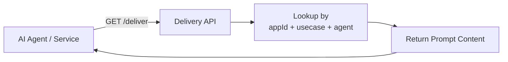

# 🚀 Runtime Delivery API

The **Runtime Delivery API** provides low-latency prompt retrieval for AI agents and backend services. Once a prompt is approved and deployed, your services fetch it at runtime without hardcoding prompt text in your codebase.

---

## How It Works



1. **Request** — Your AI agent or backend service calls the delivery endpoint with query parameters
2. **Lookup** — The API resolves the prompt by `appId`, `usecase`, and `agent` combination
3. **Response** — The latest approved/deployed prompt content is returned, ready for use with the LLM

---

## Why Runtime Delivery?

| Without Promptly | With Runtime Delivery |
|------------------|----------------------|
| Prompts hardcoded in source code | Prompts fetched dynamically at runtime |
| Prompt changes require code deployments | Update prompts without redeploying services |
| No version control for prompt text | Full versioning, rollback, and audit trail |
| No governance over prompt changes | Approval workflows enforce quality gates |
| Prompt drift across environments | Consistent prompts via Export/Import CI/CD |

---

## Query Parameters

| Parameter | Required | Description | Example |
|-----------|----------|-------------|---------|
| `appId` | ✅ | Application identifier | `customer-service` |
| `usecase` | ✅ | Use case within the app | `greeting` |
| `agent` | ❌ | Specific agent name | `support-bot` |

---

## REST API

| Method | Endpoint | Description |
|--------|----------|-------------|
| `GET` | `/api/v1/deliver?appId=X&usecase=Y&agent=Z` | Fetch the deployed prompt for the given combination |

### Example Request

```bash
curl -H "Authorization: Bearer <TOKEN>" \
  "https://promptly.example.com/api/v1/deliver?appId=customer-service&usecase=greeting&agent=support-bot"
```

### Example Response

```json
{
  "id": "p-cs-greeting",
  "name": "Customer Service Greeting",
  "content": "You are a helpful customer service assistant for Acme Corp...",
  "version": 3,
  "status": "DEPLOYED",
  "format": "MARKDOWN"
}
```

---

## Architecture

```
delivery/
├── application/
│   ├── port/in/         # DeliveryUseCase (input port)
│   └── service/         # DeliveryApplicationService
└── infrastructure/
    └── web/             # REST controller
```

The Delivery module is read-only — it queries the Prompt Registry's persistence layer to find the latest deployed version matching the delivery parameters.

---

<p align="center">
  Part of the <a href="../README.md">Promptly</a> platform · Built with ❤️ by <a href="https://github.com/spectrayan">Spectrayan</a>
</p>
