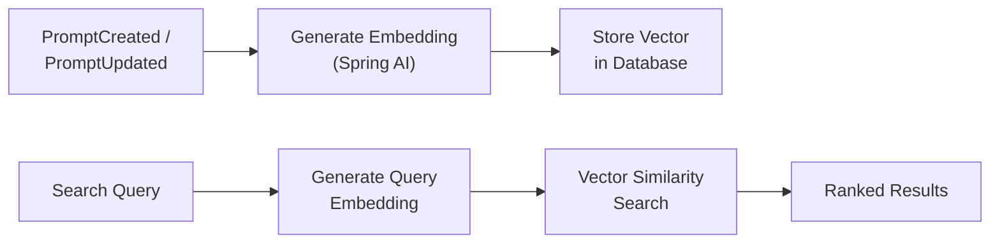

# 🔍 Semantic Search

The **Semantic Search** module provides embedding-based vector search for prompt discovery, similar prompt detection, and duplicate prevention. It uses MongoDB Atlas Vector Search (or pgvector for PostgreSQL) to find prompts by meaning rather than exact keyword match.

---

## How It Works



1. **Index** — When a prompt is created or updated, an `@EventListener` generates an embedding vector from the content using the configured LLM provider
2. **Store** — The embedding is stored alongside the prompt document in MongoDB Atlas (vector index) or PostgreSQL (pgvector)
3. **Search** — When a user searches, their natural language query is embedded and compared against all stored vectors using cosine similarity
4. **Rank** — Results are returned sorted by semantic similarity score

---

## Features

### Natural Language Search

Search for prompts using everyday language instead of exact keywords:

| Traditional Search | Semantic Search |
|-------------------|-----------------|
| `"customer support greeting"` | `"how to say hello to a customer"` |
| `"error handling prompt"` | `"what to do when something goes wrong"` |
| `"medical diagnosis"` | `"help a doctor figure out what's wrong"` |

### Similar Prompt Discovery

Find prompts that are semantically similar to a given prompt — useful for cross-team reuse and learning from existing patterns:

```
GET /api/v1/search/prompts/{id}/similar
```

### Duplicate Detection

Before creating a new prompt, check if a semantically similar one already exists:

```
POST /api/v1/search/prompts/check-duplicates
```

This prevents teams from independently creating near-identical prompts, reducing maintenance burden and ensuring consistency.

---

## REST API

| Method | Endpoint | Description |
|--------|----------|-------------|
| `GET` | `/api/v1/search?q=...&projectId=X` | Semantic search across prompts |
| `GET` | `/api/v1/search/prompts/{id}/similar` | Find prompts similar to a given prompt |
| `POST` | `/api/v1/search/prompts/check-duplicates` | Check for duplicate/similar prompts before creation |

---

## Event-Driven Indexing

The search module subscribes to prompt lifecycle events to keep embeddings in sync automatically:

| Event | Action |
|-------|--------|
| `PromptCreated` | Generate and store embedding for the new prompt |
| `PromptUpdated` | Regenerate embedding with the updated content |

This is handled by `EmbeddingOnPromptUpdatedListener` — the prompt author doesn't need to trigger indexing manually.

---

## Architecture

```
search/
├── application/
│   ├── port/in/         # SearchUseCase (input port)
│   ├── service/         # SearchApplicationService
│   └── listener/        # EmbeddingOnPromptUpdatedListener
└── infrastructure/
    └── web/             # REST controller
```

### Vector Search Backends

| Backend | Configuration | Index Type |
|---------|--------------|------------|
| **MongoDB Atlas** | Default | Atlas Vector Search index |
| **PostgreSQL** | `persistence-sql` profile | pgvector extension |

---

<p align="center">
  Part of the <a href="../README.md">Promptly</a> platform · Built with ❤️ by <a href="https://github.com/spectrayan">Spectrayan</a>
</p>
