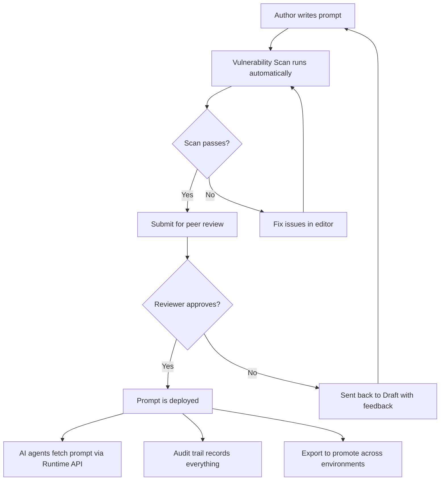

# Key Concepts

Before diving into the platform, it helps to understand the core concepts that make up Promptly's mental model. This page is written for everyone — product managers, compliance officers, engineering leaders, and developers alike.

---

## 📝 Prompt

A **prompt** is the set of instructions you give to an AI model (like GPT-4, Gemini, or Claude) to define its behavior. It tells the AI what role to play, what rules to follow, what data to reference, and how to format its response.

In Promptly, prompts are treated as **first-class managed assets** — not throwaway strings scattered across your codebase. Each prompt has a name, content, metadata, tags, and a full version history.

**Example:**
> *"You are a helpful customer support agent for Acme Corp. Always be polite. Never share internal pricing details. If the customer asks about a refund, refer them to the refund policy at acme.com/refunds."*

---

## 📦 Project

A **project** is the top-level organizational unit in Promptly. Think of it as a workspace — everything you do is scoped to a project.

Projects can represent:
- A specific product (e.g., *Customer Support Bot*)
- An environment (e.g., *Prod — Order Tracking Agent*)
- A team (e.g., *Marketing AI Tools*)

Each project has its own set of prompts, its own team members, and its own role-based access controls. This keeps prompts cleanly separated across teams and applications.

---

## 🔢 Version

Every time a prompt is edited, Promptly creates a new **version**. Versions are **immutable** — once created, they can never be altered. This gives you a complete, auditable history of every change.

| Version | Status | Author | Date |
|---------|--------|--------|------|
| v1.0.0 | Archived | Alice | Jan 10 |
| v1.0.1 | Archived | Bob | Feb 3 |
| v1.0.2 | Deployed | Alice | Mar 15 |
| v1.0.3 | Draft | Carol | Today |

You can compare any two versions with the built-in **diff viewer** and **rollback** to a previous version with a single click if needed.

---

## 🔄 Workflow

A **workflow** is the governance process a prompt goes through before reaching production. Promptly enforces a structured lifecycle:

```
DRAFT → IN REVIEW → APPROVED → DEPLOYED → ARCHIVED
```

- **Draft:** The prompt is being authored or edited. Security scans and AI improvements happen here.
- **In Review:** The prompt has been submitted for peer review. Reviewers are notified automatically.
- **Approved:** A reviewer has signed off. The prompt is now eligible for deployment.
- **Deployed:** The prompt is live and being served to AI agents via the Runtime API.
- **Archived:** A retired version that is preserved for audit purposes.

This workflow prevents unreviewed or insecure prompts from ever reaching production.

---

## 👥 Roles & Permissions (RBAC)

Promptly uses **Role-Based Access Control** to determine what each team member can do within a project.

| Role | What They Can Do |
|------|------------------|
| **Viewer** | Read-only access to prompts, scan results, and audit logs. |
| **Editor** | Create and edit prompts, run security scans, submit for review. |
| **Reviewer** | Everything an Editor can do, plus approve or reject prompts. |
| **Admin** | Full control — manage members, override workflows, configure project settings. |

This ensures that the right people are making the right decisions at every stage of the prompt lifecycle.

---

## 🛡️ Vulnerability Scan

Promptly's **Vulnerability Scanner** automatically analyzes every prompt for security risks. Scans are triggered when prompts are created or edited.

The scanner checks for:
- **Prompt injection vulnerabilities** — Can a malicious user trick the AI into ignoring its instructions?
- **PII/PHI data exposure** — Could the prompt accidentally cause the AI to reveal sensitive information?
- **Missing guardrails** — Does the prompt lack safety boundaries or role definitions?
- **Toxicity & bias risks** — Could the prompt steer the AI toward harmful or biased outputs?

Scan results are graded by severity (**Critical**, **High**, **Medium**, **Low**). Critical findings block the prompt from being submitted for review until they are resolved.

---

## 🚀 Runtime Delivery

**Runtime Delivery** is how your production AI applications retrieve prompts from Promptly at runtime — without prompts being hardcoded in your application.

Your service calls the Promptly Runtime API:
```
GET /api/v1/deliver?appId=my-app&usecase=support&agent=greeting
```

And Promptly returns the latest **approved and deployed** version of the matching prompt. This means:
- ✅ Update prompts without redeploying your application.
- ✅ Roll back instantly if a prompt causes issues.
- ✅ Different agents fetch their own specific prompts by name.

---

## 🧠 AI Quality Improver

Promptly includes a built-in **AI assistant** that can automatically rewrite and improve your prompts. With one click, the improver:
- Restructures the prompt for clarity and effectiveness.
- Adds safety guardrails and boundary instructions.
- Optimizes the prompt for the target model.

The suggested improvement appears side-by-side with your original prompt in the editor. You decide whether to apply it — it's a tool, not an override.

---

## 🔍 Semantic Search

Beyond keyword search, Promptly uses **vector embeddings** to enable semantic search across your prompt library. This means you can search by *meaning*, not just exact text:

- Search for *"customer refund handling"* and find prompts titled *"Return Policy Agent Instructions"*.
- **Duplicate detection** alerts you when a new prompt is semantically similar to an existing one, preventing sprawl.

---

## 📜 Audit Trail

Every significant action in Promptly is recorded in an **immutable audit log**:

- Prompt created, edited, deleted
- Scan triggered and completed
- Submitted for review, approved, rejected
- Deployed to production, rolled back
- Team member added or removed

The audit trail is append-only — entries cannot be modified or deleted. This provides the evidence trail needed for compliance audits (SOC 2, HIPAA, ISO 27001) and internal governance reviews.

---

## 📤 Export & Import

Promptly's **Export/Import** APIs enable CI/CD-driven deployment across environments:

- **Export:** Download all approved prompts from one instance as a portable JSON bundle.
- **Import:** Upload that bundle into another instance (e.g., staging → production).

This keeps each Promptly instance focused on a single environment while your existing CI/CD tooling handles promotion — just like you already manage code deployments.

---

## How It All Fits Together



Every concept works together to form a **complete governance lifecycle** — from authoring to deployment to audit — ensuring your AI behaves exactly as intended.
