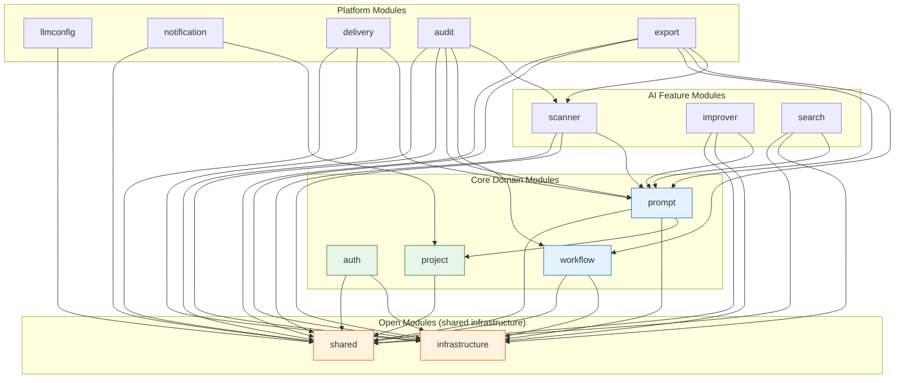
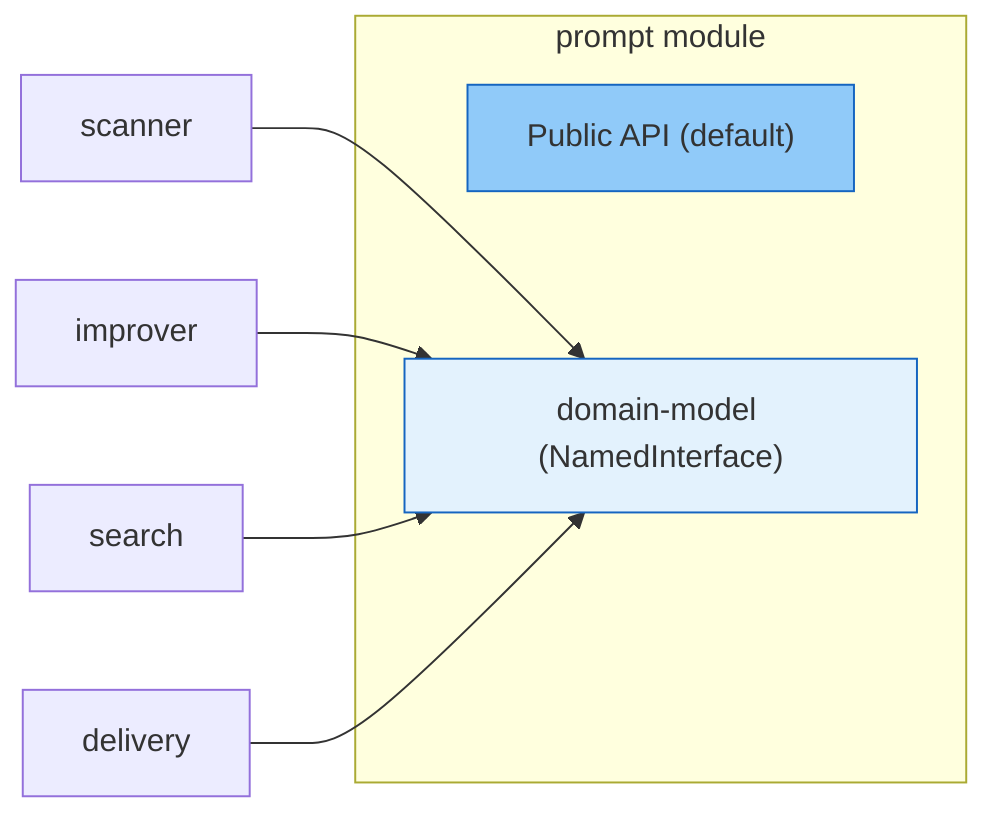

# ADR-004: Spring Modulith — Module Boundaries & Dependency Rules

**Status:** Accepted  
**Date:** 2026-04-26  
**Authors:** Spectrayan Team

---

## Context

Promptly's backend is a single Spring Boot 4 application containing 12+ bounded contexts (Prompt, Workflow, Auth, Project, Notification, LLM Config, Scanner, Improver, Search, Delivery, Audit, Export). Without explicit boundary enforcement, cross-module dependencies degrade into a tangle where every module reaches into every other module's internals.

We needed a mechanism to:
1. Declare and enforce which modules may depend on which
2. Allow shared infrastructure without creating a monolithic "commons" module
3. Support fine-grained sub-module access (e.g., expose only domain models)

## Decision

Use **Spring Modulith** annotations on `package-info.java` to declare explicit module boundaries and enforce them via architecture tests.

### Module Dependency Map



### Module Types

| Module | Type | `allowedDependencies` |
|--------|------|-----------------------|
| `shared` | `OPEN` | — (visible to all) |
| `infrastructure` | `OPEN` | — (visible to all) |
| `auth` | Standard | `shared`, `infrastructure` |
| `project` | Standard | (none declared — relies on shared) |
| `prompt` | Standard | `shared`, `infrastructure`, `project` |
| `workflow` | Standard | `shared`, `infrastructure` |
| `scanner` | Standard | `shared`, `infrastructure`, `prompt`, `prompt::domain-model` |
| `improver` | Standard | `shared`, `infrastructure`, `prompt`, `prompt::domain-model` |
| `search` | Standard | `shared`, `infrastructure`, `prompt`, `prompt::domain-model` |
| `delivery` | Standard | `shared`, `infrastructure`, `prompt`, `prompt::domain-model` |
| `llmconfig` | Standard | `shared`, `shared::config` |
| `notification` | Standard | `shared`, `project` |
| `audit` | Standard | `shared`, `infrastructure`, `prompt`, `workflow`, `scanner` |
| `export` | Standard | `shared`, `infrastructure`, `shared::config`, `prompt`, `workflow`, `scanner` |

### Named Interfaces

The `prompt` module exposes a `NamedInterface("domain-model")` on its `domain.model` package, allowing downstream modules (scanner, improver, search, delivery) to reference `Prompt` and `PromptVersion` domain objects without accessing the full module.



### Inter-Module Communication

Modules communicate via **Spring Modulith application events**, not direct method calls across boundaries:

```java
// Prompt module publishes:
public record PromptCreated(String promptId, String projectId) {}
public record PromptUpdated(String promptId, int version) {}

// Audit module listens:
@ApplicationModuleListener
void on(PromptCreated event) { /* create audit entry */ }
```

## Consequences

### Positive
- Compilation-time dependency validation via `@ApplicationModuleTest`
- Clear visual map of what depends on what
- New developers can read `package-info.java` files to understand module boundaries

### Negative
- Adding a new cross-module dependency requires editing `package-info.java` — intentional friction
- Some test failures are caused by Modulith context loading, not actual bugs (known issue)
