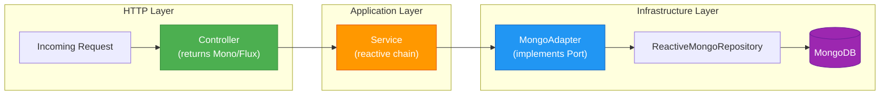
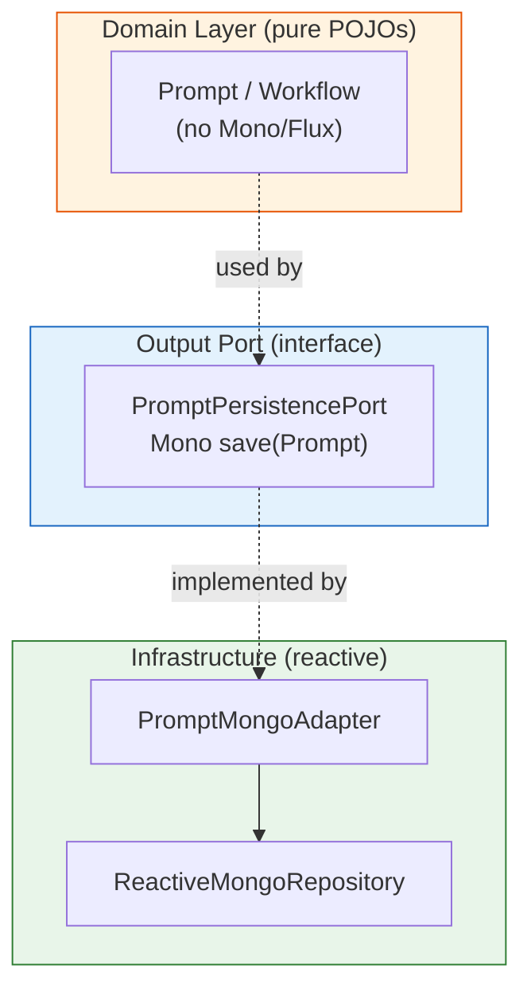

# ADR-008: Reactive Persistence with WebFlux & MongoDB

**Status:** Accepted  
**Date:** 2026-04-26  
**Authors:** Spectrayan Team

---

## Context

Promptly is an AI governance platform where many operations involve external LLM API calls (scanning, improving) that can take seconds. A blocking thread model (Spring MVC + synchronous MongoDB driver) would exhaust the thread pool under moderate load when multiple scans run concurrently.

We needed a non-blocking architecture from the HTTP layer through to the database.

## Decision

Use **Spring WebFlux** (reactive web) with **Reactive MongoDB** (Spring Data MongoDB Reactive) and **Project Reactor** types (`Mono<T>`, `Flux<T>`) throughout the stack.

### Reactive Flow

### Layered Return Types

| Layer | Return Type | Example |
|-------|------------|---------|
| Controller | `Mono<ResponseEntity<T>>` / `Flux<T>` | `Mono<ResponseEntity<PromptResponse>>` |
| Application Service | `Mono<T>` / `Flux<T>` | `Mono<Prompt>` |
| Output Port (interface) | `Mono<T>` / `Flux<T>` | `Mono<Prompt> save(Prompt)` |
| Persistence Adapter | `Mono<T>` / `Flux<T>` | Delegates to `ReactiveMongoRepository` |

### Domain Model Isolation

Domain aggregates (`Prompt`, `Workflow`, etc.) are **pure POJOs** — they contain no reactive types. The reactive boundary exists at the port/adapter layer:

### Persistence Mapping

Each module uses a **Document ↔ Domain** mapping pattern:

| Class | Location | Role |
|-------|----------|------|
| `Prompt` | `domain/model/` | Pure domain aggregate (no `@Document`) |
| `PromptDocument` | `infrastructure/persistence/entity/` | MongoDB document with `@Document`, `@Id` annotations |
| `PromptPersistenceMapper` | `infrastructure/persistence/mapper/` | MapStruct mapper between domain and document |
| `PromptMongoAdapter` | `infrastructure/persistence/repository/` | Implements `PromptPersistencePort`, uses mapper |
| `PromptReactiveMongoRepository` | `infrastructure/persistence/repository/` | Spring Data reactive interface |

### Why Not Spring MVC?

| Concern | Spring MVC | Spring WebFlux |
|---------|:----------:|:--------------:|
| Thread model | Thread-per-request | Event loop (Netty) |
| Concurrent LLM calls | Blocks threads | Non-blocking backpressure |
| MongoDB driver | Synchronous | Reactive (non-blocking I/O) |
| SSE streaming | Possible but awkward | Native `Flux<ServerSentEvent>` |
| Memory under load | High (thread stacks) | Low (event-driven) |

## Consequences

### Positive
- Non-blocking I/O end-to-end — HTTP through MongoDB
- Natural fit for SSE streaming (audit logs, scan progress)
- Efficient under concurrent LLM scan workloads
- Backpressure propagation from database to HTTP

### Negative
- Steeper learning curve for developers new to reactive programming
- Debugging stack traces is harder with reactive chains
- Domain model must stay free of reactive types (deliberate constraint)
- Some blocking libraries require `Schedulers.boundedElastic()` wrapping
