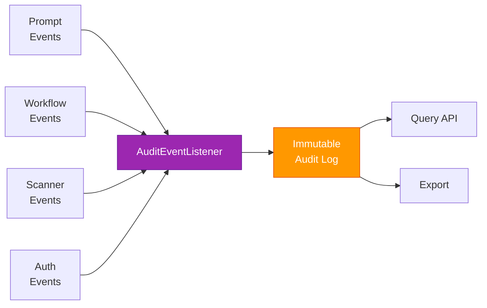

# 📝 Audit & Compliance — Deep Dive

The Audit module provides an immutable, append-only audit trail of every action in the platform. It uses `@EventListener` to capture domain events from all modules and persists them as compliance-ready audit entries.

---

## Event Capture Flow

---

## Events Captured

| Source | Events |
|--------|--------|
| **Prompt** | `PromptCreated`, `PromptUpdated`, `PromptDeleted` |
| **Workflow** | `PromptSubmittedForReview`, `PromptApproved`, `PromptRejected` |
| **Scanner** | `ScanCompleted`, `ScanFailed` |
| **Auth** | `UserLoggedIn`, `UserRegistered` |
| **Project** | `ProjectCreated`, `MemberAdded`, `MemberRemoved` |

---

## Audit Entry Structure

| Field | Type | Description |
|-------|------|-------------|
| `id` | `string` | Unique entry ID |
| `eventType` | `string` | Event name |
| `entityType` | `string` | `PROMPT`, `WORKFLOW`, `USER`, etc. |
| `entityId` | `string` | Affected entity ID |
| `projectId` | `string` | Project scope |
| `userId` | `string` | Actor |
| `details` | `object` | Event payload |
| `timestamp` | `Instant` | When it occurred |

---

## Immutability

- **No update or delete API** — entries are append-only
- **AOP-based capture** via `AuditAspect` — no manual logging
- Satisfies **SOC 2**, **HIPAA**, and regulated industry requirements

---

## REST API

| Method | Endpoint | Description |
|--------|----------|-------------|
| `GET` | `/api/v1/audit?projectId=X` | List audit entries (filtered, paginated) |
| `GET` | `/api/v1/audit/export?projectId=X` | Export audit log |
