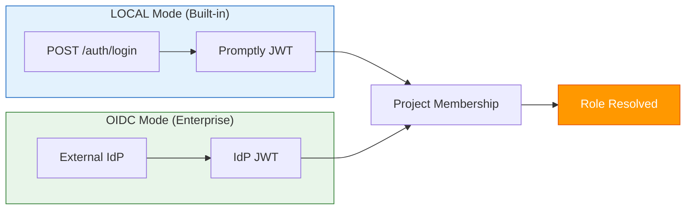

# 🔐 Auth & RBAC — Deep Dive

!!! tip "See also"
    For a comprehensive description of the RBAC design decisions, see [ADR-002: Project RBAC](../architecture/adrs/002-project-rbac.md).

Promptly supports **dual-mode authentication** (LOCAL + OIDC) and **project-scoped RBAC** with five roles designed for enterprise AI governance.

---

## Authentication Modes



---

## Role Matrix

| Action | Viewer | Author | Reviewer | Approver | Admin |
|--------|:------:|:------:|:--------:|:--------:|:-----:|
| View prompts | ✅ | ✅ | ✅ | ✅ | ✅ |
| Create / edit | — | ✅ | — | — | ✅ |
| Submit for review | — | ✅ | — | — | ✅ |
| Review & request changes | — | — | ✅ | ✅ | ✅ |
| Approve / reject | — | — | — | ✅ | ✅ |
| Trigger scans | — | ✅ | ✅ | ✅ | ✅ |
| Delete prompts | — | — | — | — | ✅ |
| Manage members | — | — | — | — | ✅ |

---

## REST API

### Authentication (LOCAL mode)

| Method | Endpoint | Description |
|--------|----------|-------------|
| `POST` | `/api/v1/auth/register` | Register user |
| `POST` | `/api/v1/auth/login` | Login → JWT |
| `POST` | `/api/v1/auth/refresh` | Refresh JWT |
| `GET` | `/api/v1/auth/me` | Current user |
| `GET` | `/api/v1/users` | List users |

### Project Members

| Method | Endpoint | Description |
|--------|----------|-------------|
| `GET` | `/api/v1/projects/{id}/members` | List members |
| `POST` | `/api/v1/projects/{id}/members` | Add member |
| `PUT` | `/api/v1/projects/{id}/members/{mid}` | Update role |
| `DELETE` | `/api/v1/projects/{id}/members/{mid}` | Remove member |

---

## Configuration

```yaml
promptly:
  auth:
    provider: local           # local | oidc
```
