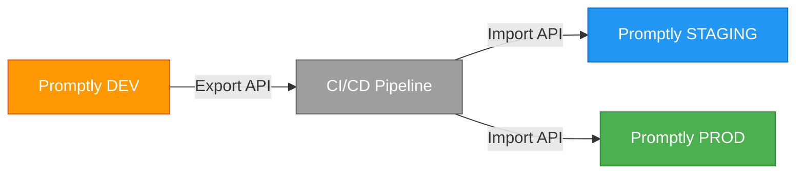

# 📤 Export / Import — Deep Dive

The Export / Import module enables CI/CD-driven prompt deployment across environments (dev → staging → production).

---

## Cross-Environment Promotion



---

## REST API

| Method | Endpoint | Description |
|--------|----------|-------------|
| `GET` | `/api/v1/exchange/export/prompts/{id}` | Export a single prompt |
| `GET` | `/api/v1/exchange/export/project/{projectId}` | Export all prompts in a project |
| `POST` | `/api/v1/exchange/import` | Import a prompt bundle |

---

## GitHub Actions Example

```yaml
name: Promote Prompts
on: workflow_dispatch
jobs:
  promote:
    runs-on: ubuntu-latest
    steps:
      - name: Export from DEV
        run: |
          curl -H "Authorization: Bearer $DEV_TOKEN" \
            "$DEV_URL/api/v1/exchange/export/project/my-project" -o prompts.json
      - name: Import to PROD
        run: |
          curl -X POST -H "Authorization: Bearer $PROD_TOKEN" \
            -H "Content-Type: application/json" \
            -d @prompts.json "$PROD_URL/api/v1/exchange/import"
```
