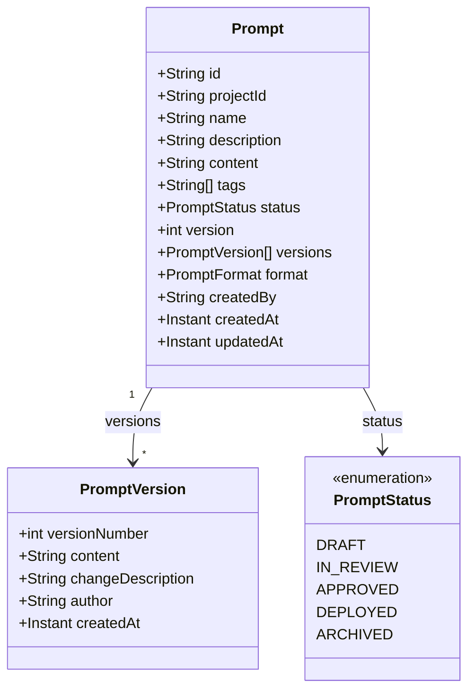
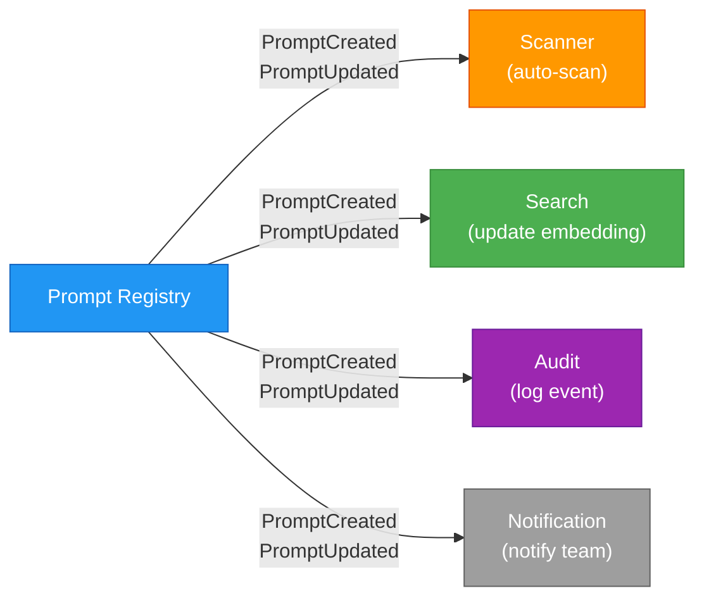

# 📋 Prompt Registry — Deep Dive

!!! tip "See also"
    For a user-guide view of the registry, see the [Prompt Registry](../user-guide/prompt-registry.md) page.

The Prompt Registry is Promptly's core module — the single source of truth for all AI prompt templates. Every prompt is an **aggregate root** with immutable versioning.

---

## Domain Model



---

## Event-Driven Integration

When a prompt is created or updated, domain events trigger downstream processing:



---

## REST API

| Method | Endpoint | Description |
|--------|----------|-------------|
| `POST` | `/api/v1/prompts` | Create a new prompt |
| `GET` | `/api/v1/prompts` | List prompts (filtered, paginated) |
| `GET` | `/api/v1/prompts/{id}` | Get prompt detail |
| `PUT` | `/api/v1/prompts/{id}` | Update prompt (creates new version) |
| `DELETE` | `/api/v1/prompts/{id}` | Delete prompt |
| `GET` | `/api/v1/prompts/{id}/versions` | List all versions |
| `GET` | `/api/v1/prompts/{id}/versions/{v}` | Get specific version |
| `POST` | `/api/v1/prompts/{id}/rollback/{v}` | Rollback to version |

---

## Hexagonal Architecture

```
prompt/
├── domain/model/              # Prompt, PromptVersion (pure POJOs)
├── application/
│   ├── port/in/               # PromptUseCase
│   ├── port/out/              # PromptPersistencePort
│   ├── service/               # PromptApplicationService
│   └── listener/              # PromptStatusEventListener
└── infrastructure/
    ├── web/                   # REST controller
    └── persistence/           # MongoAdapter, Document, Mapper
```
