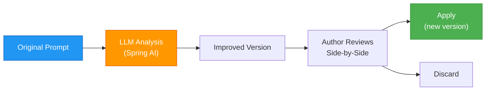

# ✨ Quality Improver — Deep Dive

Promptly's Quality Improver uses LLM-powered analysis to help authors refine, strengthen, and optimize their prompts through a **generate → review → apply** flow.

---

## Improvement Flow



---

## What Gets Improved

| Dimension | Before | After |
|-----------|--------|-------|
| **Clarity** | "Help with code" | "You are a Python debugging assistant. When the user shares code…" |
| **Safety** | No guardrails | "You must refuse requests for harmful, illegal, or unethical actions" |
| **Structure** | Flat text block | Organized sections with headers, examples, and constraints |
| **Specificity** | "Be helpful" | "Respond in JSON format with keys: `diagnosis`, `fix`, `explanation`" |

---

## Generate from Idea

Bootstrap a complete prompt from a brief description:

```
Input:  "A chatbot that helps users debug Python code"
Output: Full prompt with system identity, role boundaries, output format,
        safety guardrails, and edge-case handling
```

---

## REST API

| Method | Endpoint | Description |
|--------|----------|-------------|
| `POST` | `/api/v1/prompts/{id}/improve` | Generate an AI improvement |
| `POST` | `/api/v1/prompts/{id}/apply-improvement` | Apply improvement (creates new version) |
| `POST` | `/api/v1/prompts/generate-from-idea` | Generate prompt from brief idea |

---

## Configuration

| Property | Description | Default |
|----------|-------------|---------|
| `promptly.improver.llm-provider` | LLM provider | `gemini` |
| `promptly.improver.llm-model` | Model name | `gemini-2.5-flash` |
