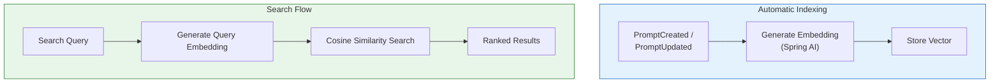

# 🔍 Semantic Search — Deep Dive

The Semantic Search module provides embedding-based vector search for prompt discovery, similar prompt detection, and duplicate prevention using MongoDB Atlas Vector Search.

---

## How It Works

---

## Features

| Feature | Endpoint | Description |
|---------|----------|-------------|
| **Natural Language Search** | `GET /api/v1/search?q=...` | Find prompts by meaning, not keywords |
| **Similar Prompts** | `GET /api/v1/search/prompts/{id}/similar` | Discover related prompts |
| **Duplicate Detection** | `POST /api/v1/search/prompts/check-duplicates` | Prevent redundant prompts |

---

## Event-Driven Indexing

`EmbeddingOnPromptUpdatedListener` automatically reindexes when prompts change:

| Event | Action |
|-------|--------|
| `PromptCreated` | Generate and store embedding |
| `PromptUpdated` | Regenerate embedding |

---

## REST API

| Method | Endpoint | Description |
|--------|----------|-------------|
| `GET` | `/api/v1/search?q=...&projectId=X` | Semantic search |
| `GET` | `/api/v1/search/prompts/{id}/similar` | Find similar prompts |
| `POST` | `/api/v1/search/prompts/check-duplicates` | Check for duplicates |
