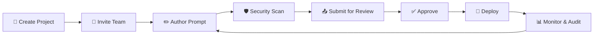

# Getting Started — For Teams

Welcome to Promptly! This guide walks you through adopting Promptly for AI prompt governance. No technical background required — this is for product managers, team leads, compliance officers, and anyone involved in managing AI behavior.

---

## Step 1: Create Your First Project

Everything starts with a **Project** — your workspace that groups related prompts and controls access.

**When to create a project:**
- One project per product (e.g., *"Customer Support Bot"*)
- One project per business unit (e.g., *"Marketing AI Tools"*)
- One project per environment (e.g., *"Prod — Order Agent"*)

**To create a project:**
1. Log in to Promptly.
2. Click the **project selector** in the top navigation bar.
3. Select **"New Project"** and give it a name and description.

---

## Step 2: Invite Your Team

Promptly uses role-based access to ensure the right people have the right level of control.

| Role | Best For |
|------|----------|
| **Viewer** | Stakeholders who need read-only access. |
| **Editor** | Prompt authors — people writing AI instructions. |
| **Reviewer** | Team leads or domain experts who approve prompts. |
| **Admin** | Project owners who manage settings and membership. |

Navigate to **Settings → Members** to invite team members and assign roles.

---

## Step 3: Author Your First Prompt

Navigate to the **Prompt Registry** and click **"New Prompt"**.

Provide:
- **Name** — A clear identifier (e.g., `refund-policy-agent`).
- **Content** — The instructions for the AI. Use the built-in Monaco Editor.
- **Tags** — Optional labels for organization (e.g., `customer-service`, `billing`).
- **Model Configuration** — Target AI model and parameters like temperature.

Your prompt is created in **Draft** status — safe to experiment.

---

## Step 4: Scan for Vulnerabilities

Run a **Security Scan** before submitting for review. The AI-powered scanner checks for:
- 🔓 Prompt injection risks
- 🕵️ PII/PHI data exposure
- 🚧 Missing safety guardrails
- ⚠️ Toxicity and bias concerns

**Results:**
- **Green (Pass):** Good to submit.
- **Yellow (Warnings):** Non-critical recommendations.
- **Red (Critical):** Must fix before proceeding. Remediation guidance is provided.

---

## Step 5: Submit for Review

Click **"Submit for Review"** to move from `DRAFT` to `IN_REVIEW`. Reviewers are notified automatically.

**What reviewers see:**
- Full prompt content
- A **diff viewer** showing exactly what changed
- Security scan results

Reviewers can **Approve** or **Reject** with comments.

---

## Step 6: Deploy

Once approved, deploy the prompt. It becomes immediately available via the **Runtime Delivery API**.

- No code changes required in your application.
- AI agents automatically use the latest approved version.
- **Rollback** to any previous version with one click if needed.

---

## Step 7: Monitor & Audit

With your prompt live:
- **Dashboard** — Real-time stats: total prompts, deployed count, prompts in review, security alerts.
- **Audit Viewer** — Complete history of every action on every prompt.
- **Security Scans** — Track your security posture over time.

---

## The Full Lifecycle

---

## What's Next?

- [Key Concepts](../about/key-concepts.md) — Understand the building blocks of the platform.
- [Use Cases](../about/use-cases.md) — See how teams in different industries use Promptly.
- [Why Promptly?](../about/why-promptly.md) — Share the value proposition with stakeholders.
- [Platform Overview](platform-overview.md) — Dive deeper into the UI and features.

> 💡 **Tip:** You don't need to be a developer to use Promptly. The platform is designed so that product managers, compliance teams, and business stakeholders can participate directly in AI governance.
