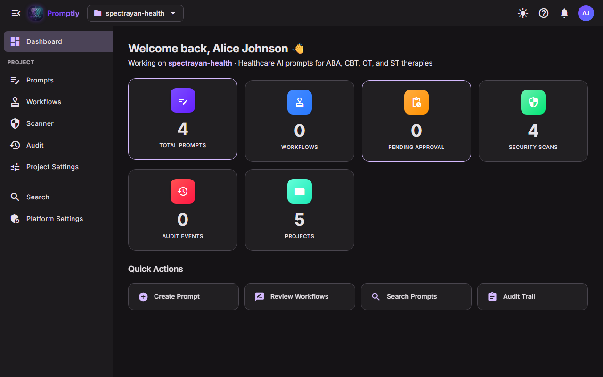
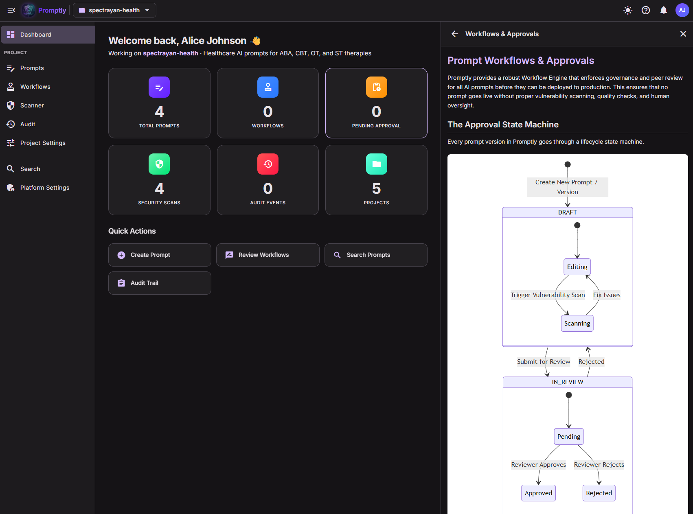
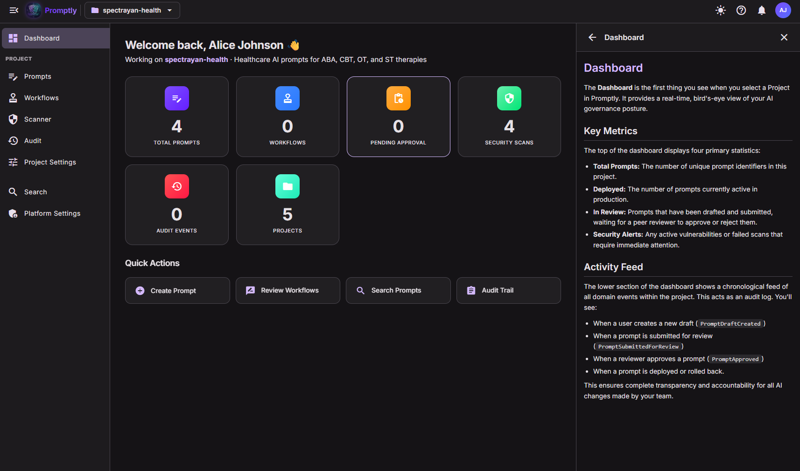

# Dashboard

The **Dashboard** is the first thing you see when you select a Project in Promptly. It provides a real-time, bird's-eye view of your AI governance posture.

  

## Key Metrics

The top of the dashboard displays six primary statistics:

* **Total Prompts:** The number of unique prompt identifiers in this project.
* **Workflows:** Active workflow instances currently in progress.
* **Pending Approval:** Prompts that have been submitted and are waiting for a peer reviewer to approve or reject them.
* **Security Scans:** The total number of vulnerability scans executed across all prompts.
* **Audit Events:** The count of recorded domain events (creates, updates, approvals, etc.).
* **Projects:** The total number of projects you have access to across the platform.

## Quick Actions

Below the metrics, four quick-action cards provide one-click navigation to common tasks:

* **Create Prompt** — Jump straight to the new prompt creation form.
* **Review Workflows** — Navigate to pending approval workflows that need your attention.
* **Search Prompts** — Open the semantic search page to find prompts by natural language.
* **Audit Trail** — Browse the full audit log with filters and event details.

## Activity Feed

The lower section of the dashboard shows a chronological feed of all domain events within the project. This acts as an audit log. You'll see:

* When a user creates a new draft (`PromptDraftCreated`)
* When a prompt is submitted for review (`PromptSubmittedForReview`)
* When a reviewer approves a prompt (`PromptApproved`)
* When a prompt is deployed or rolled back.

This ensures complete transparency and accountability for all AI changes made by your team.

## Built-in Contextual Help

Click the **?** icon in the application header to open the contextual help panel. The panel provides page-specific documentation right inside the app — no need to leave your workflow.

  

The help panel displays documentation relevant to the current page. On the Dashboard, it explains:

* What each metric card represents
* How the Activity Feed works and what events are tracked
* Tips for navigating the platform

The help content adapts as you navigate — each page in Promptly has its own documentation topic that appears automatically when the panel is open.

  

Here the help panel shows the **Workflows & Approvals** documentation with a full state-machine diagram explaining the Draft → Review → Approve lifecycle — useful for understanding how prompts progress through governance stages.
