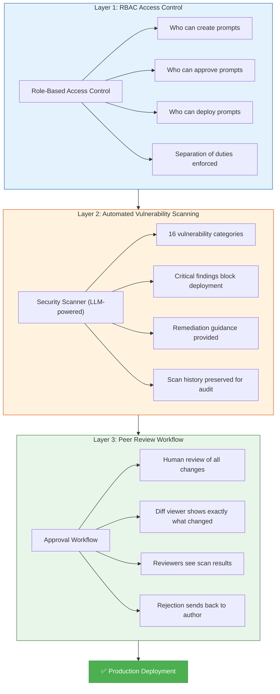
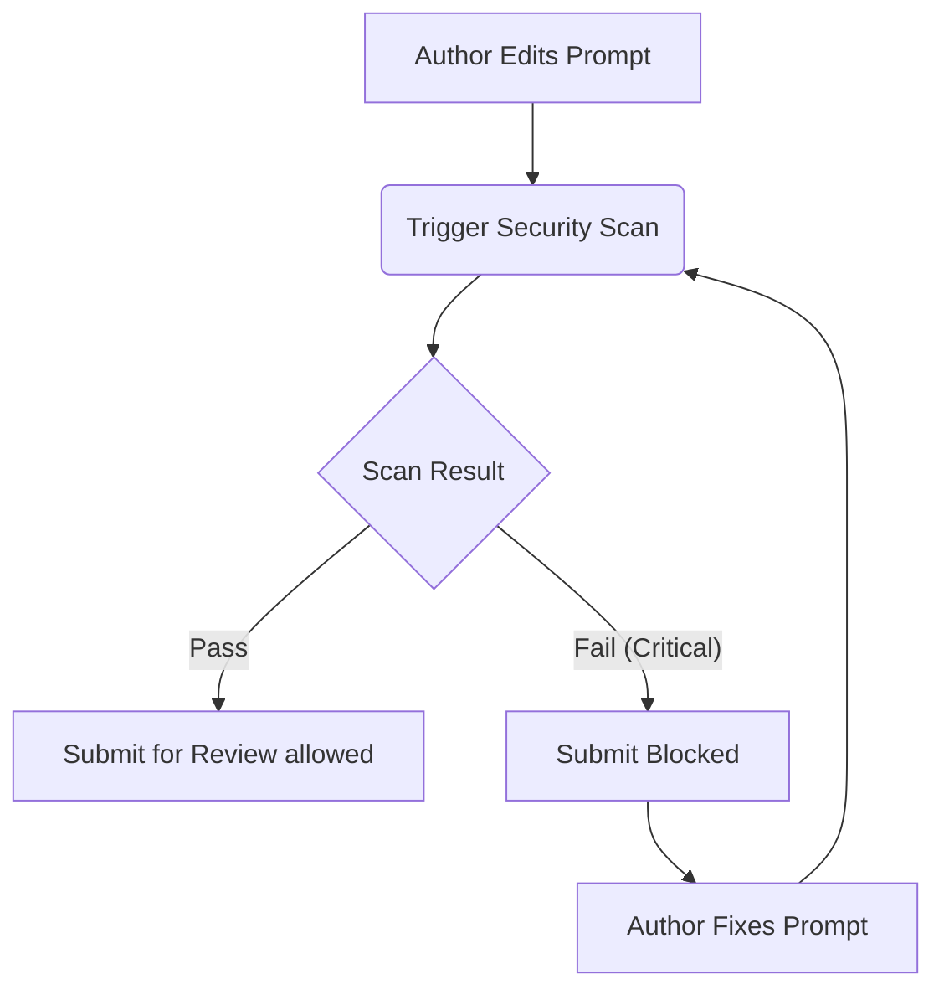

# Security & Vulnerability Scanning

Promptly is built with enterprise AI safety in mind. LLMs are powerful, but they are also susceptible to malicious inputs and hallucinated outputs. Promptly provides a **defense-in-depth** security strategy that combines three layers of protection to ensure no vulnerable prompt reaches production.

---

## Defense in Depth: Three Layers of Protection

Promptly's security model is built on three complementary layers that work together to create a comprehensive security posture:

### Layer 1: RBAC Access Control

Before a prompt can even be created or modified, Promptly's role-based access control determines who has permission to act. This prevents unauthorized changes at the source:

- **Viewers** can see deployed prompts but cannot edit
- **Editors** can create and modify prompts, run scans, and submit for review
- **Reviewers** can approve or reject prompts (and cannot approve their own)
- **Admins** have full control including workflow bypass for emergencies

The separation of duties between authors and reviewers is a technical control — it cannot be bypassed through the UI or API.

### Layer 2: Automated Vulnerability Scanning

Every prompt is automatically scanned by the LLM-powered security scanner before it can enter the review process. The scanner checks for 16 categories of vulnerabilities including prompt injection, data exfiltration, jailbreak susceptibility, and regulatory violations.

Critical findings **block submission entirely** — the author must fix the issues before the prompt can proceed through the workflow.

👉 **For comprehensive scanner documentation, see the [Security Scanner](scanner.md) page.**

### Layer 3: Peer Review Workflow

Even after passing automated scanning, every prompt must be reviewed and approved by a human reviewer. Reviewers see the scan results alongside the diff, giving them full context for their decision:

- The diff shows exactly what content changed
- Scan results show the security assessment
- Reviewers can approve, reject, or request changes
- Rejected prompts return to the author with feedback

Together, these three layers ensure that a vulnerable prompt would need to evade automated detection AND fool a human reviewer AND have been created by an authorized user — making security incidents extremely unlikely.

---

## The Security Scanner

Every time a prompt is edited or created, it is automatically passed through the Promptly Security Scanner (powered by Spring AI).

The scanner performs static analysis and AI-driven checks on the prompt content.

### Checks Performed

1. **Prompt Injection Detection:** The scanner looks for patterns that indicate the prompt is vulnerable to injection attacks (e.g., missing `<input>` boundary tags, or lack of strong system instructions).
2. **PII Leakage Prevention:** The scanner ensures that the prompt instructions explicitly forbid the LLM from outputting Personally Identifiable Information (PII) like social security numbers or credit cards.
3. **Toxicity & Bias:** Checks if the prompt instructions could inadvertently steer the model towards toxic, biased, or harmful responses.
4. **Jailbreak Resistance:** Evaluates whether the prompt includes sufficient guardrails to resist jailbreak attempts (DAN attacks, roleplay exploits, hypothetical scenarios).
5. **Data Exfiltration Prevention:** Checks that the prompt includes output restrictions that prevent the AI from leaking system details, training data, or internal information.
6. **Regulatory Compliance:** Identifies prompts that handle regulated data (PII, PHI, financial information) without appropriate handling instructions.

👉 **For the full list of 16 vulnerability categories, scoring details, and scanner UI documentation, see the [Security Scanner](scanner.md) page.**

### Handling Security Alerts

If the scanner detects an issue, the prompt will be flagged in the UI.
* **Warnings:** Non-critical issues that serve as recommendations. You can still submit the prompt for review.
* **Critical Vulnerabilities:** Serious issues that *block* the prompt from being submitted. You must resolve these issues before the workflow can proceed.

This ensures that vulnerable prompts never even make it to the peer-review stage, drastically reducing the risk of a security incident in production.

---

## How the Layers Work Together

Consider a real-world scenario: an attacker gains access to an Editor account and tries to insert a malicious instruction into a prompt.

1. **Layer 1 (RBAC):** The attacker can edit prompts (they have Editor access), but they cannot approve their own changes — separation of duties is enforced.
2. **Layer 2 (Scanner):** When they submit the modified prompt, the scanner detects the injection pattern and reports a CRITICAL finding. If the finding is critical, submission is blocked entirely.
3. **Layer 3 (Review):** Even if the injection is subtle enough to pass the scanner, the human reviewer sees the diff and the scan results. The malicious instruction would be visible in the change history.

Additionally, the **audit trail** records every action — so even if the attack somehow succeeded, forensic investigation would show exactly what changed, when, and by whom.

This is the power of defense in depth: no single point of failure, and multiple independent controls that must all be bypassed for an attack to succeed.
