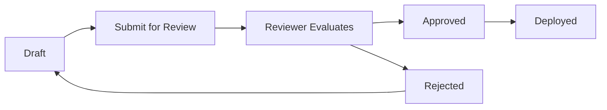
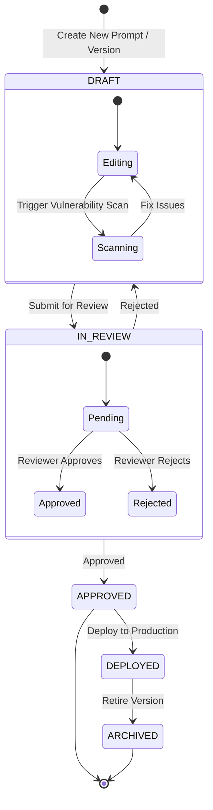

# ⚙️ Workflow Engine

The **Workflow Engine** enforces governance and peer review for all AI prompts before they can be deployed to production. No prompt goes live without proper vulnerability scanning, quality checks, and human oversight.

---

## How It Works



1. **Draft** — Author creates or edits a prompt. Scans run in the background
2. **Submit** — Author submits the prompt for peer review
3. **Review** — Reviewer sees the content, diff, and scan results
4. **Approve / Reject** — Reviewer approves (→ ready for deployment) or rejects (→ back to Draft with comments)
5. **Deploy** — Approved prompts are available via the Runtime Delivery API

---

## The Approval State Machine

Every prompt version goes through a lifecycle state machine:



---

## Workflow Roles & Permissions

| Role | Capabilities in Workflow |
|------|--------------------------|
| **Viewer** | Can view deployed prompts and audit logs. Cannot edit or submit workflows. |
| **Editor** | Can create drafts, edit prompts, run vulnerability scans, and submit for review. |
| **Reviewer** | All Editor permissions + Can Approve or Reject prompts in `IN_REVIEW` state. |
| **Admin** | All Reviewer permissions + Can bypass workflow, force deploy, and manage project settings. |

---

## Domain Events

The Workflow Engine publishes events consumed by other modules:

| Event | Trigger | Consumers |
|-------|---------|-----------|
| `PromptSubmittedForReview` | Author submits prompt | Notification, Audit |
| `PromptApproved` | Reviewer approves prompt | Notification, Audit |
| `PromptRejected` | Reviewer rejects prompt | Notification, Audit |
| `PromptDeployed` | Prompt deployed to production | Audit |

---

## REST API

| Method | Endpoint | Description |
|--------|----------|-------------|
| `GET` | `/api/v1/workflows` | List workflows (filtered by `projectId`) |
| `GET` | `/api/v1/workflows/{id}` | Get workflow detail |
| `POST` | `/api/v1/workflows/submit-review` | Submit a prompt for review |
| `POST` | `/api/v1/workflows/{id}/approve` | Approve a workflow step |
| `POST` | `/api/v1/workflows/{id}/reject` | Reject a workflow step |

---

## Architecture

```
workflow/
├── domain/
│   └── model/           # Workflow, WorkflowStep, WorkflowStatus (pure POJOs)
├── application/
│   ├── port/in/         # WorkflowUseCase (input port)
│   ├── port/out/        # WorkflowPersistencePort (output port)
│   └── service/         # WorkflowApplicationService
└── infrastructure/
    ├── web/             # REST controller
    └── persistence/     # MongoAdapter, Document, Mapper
```

---

<p align="center">
  Part of the <a href="../README.md">Promptly</a> platform · Built with ❤️ by <a href="https://github.com/spectrayan">Spectrayan</a>
</p>
