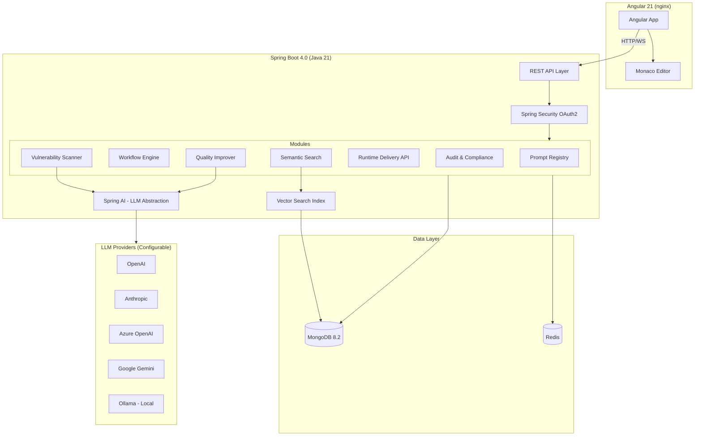

# Promptly — Implementation Plan

## Overview

**Promptly** is an enterprise AI governance platform providing lifecycle management for AI prompts, agent instructions, and LLM behavioral configurations. It is the control plane for AI behavior — combining versioning, workflows, security scanning, quality improvement, runtime delivery, and audit compliance.

---

## Tech Stack (Locked In)

| Layer | Technology |
|---|---|
| **Frontend** | Angular 21 + TypeScript |
| **UI Components** | Angular Material + custom design system |
| **Prompt Editor** | Monaco Editor |
| **Backend** | Java 21+ / Spring Boot 4.0 (Spring Framework 7) |
| **API Layer** | Spring WebFlux (reactive, non-blocking) |
| **API Versioning** | Spring Framework 7 native REST API versioning |
| **LLM Integration** | Spring AI (multi-provider, configurable) |
| **Database** | MongoDB 8.2 — Reactive Driver (Atlas in prod, `mongodb-atlas-local` for dev) |
| **Search** | MongoDB Atlas Vector Search (semantic + duplicate detection) |
| **Cache** | Redis — Reactive Lettuce |
| **Auth** | Spring Security Reactive + OAuth2 Resource Server |
| **CRUD Operations** | WebFlux (Mono/Flux) — non-blocking end-to-end |
| **Async LLM Tasks** | Virtual Threads (`@Async` with VT executor) — scanner, improver, embeddings |
| **Modularity** | Spring Modulith (module boundaries, event-driven integration, ArchUnit verification) |
| **Inter-Module Communication** | Spring Application Events + `@ApplicationModuleListener` |
| **Resilience** | Built-in `@Retryable` + `@ConcurrencyLimit` (no Resilience4j needed) |
| **Observability** | Micrometer 2 + OpenTelemetry |
| **JSON** | Jackson 3 |
| **API Docs** | SpringDoc OpenAPI (WebFlux-compatible) |
| **Containers** | Docker + Docker Compose |

### Spring Boot 4 Features We Leverage

| Feature | How Promptly Uses It |
|---|---|
| **Native API Versioning** | Version the Runtime Delivery API (`/v1/deliver`, `/v2/deliver`) natively — no custom filters |
| **Built-in `@Retryable`** | Retry failed LLM calls (scanner, improver) without Resilience4j dependency |
| **Built-in `@ConcurrencyLimit`** | Throttle concurrent LLM calls per endpoint — prevents API rate limit exhaustion |
| **Modular Auto-Config** | 70+ focused JARs = faster startup, smaller Docker image |
| **Jackson 3** | Improved JSON processing for structured prompts (JSON/YAML) |
| **JSpecify Null-Safety** | Compile-time null checks across the codebase |
| **Micrometer 2 + OpenTelemetry** | Built-in observability — metrics, traces, logs for the Runtime Delivery API (P99 latency tracking) |
| **Declarative HTTP Clients** | Clean interface-based clients for LLM provider APIs |

### Spring Modulith — Modular Monolith

Each bounded context is a **Spring Modulith application module** — a top-level package that Spring Modulith enforces as a boundary. Modules communicate **only via Spring Application Events**, never by direct service injection (except `shared`).

| Modulith Feature | How Promptly Uses It |
|---|---|
| **Module boundaries** | Each bounded context is a top-level package. Sub-packages are internal by default. |
| **`@NamedInterface`** | Only domain events + public DTOs are exposed via `package-info.java` annotations |
| **`@ApplicationModuleListener`** | Async, transactional event listeners for cross-module integration (e.g., PromptUpdated → trigger scan) |
| **`ApplicationModules.verify()`** | ArchUnit test in CI — fails build if any module accesses another module's internals |
| **Module documentation** | Auto-generated module dependency diagrams |

> [!NOTE]
> **Event reliability decision**: We skip Spring Modulith's Event Publication Registry (outbox) for MVP — it requires imperative `PlatformTransactionManager` which conflicts with our reactive MongoDB stack. For MVP, `@ApplicationModuleListener` (async, fire-and-forget) is sufficient. In the future, we will build a **custom event reprocessing mechanism** tailored to our reactive stack rather than depending on Modulith's outbox.

---

## System Architecture — Hybrid Reactive Model

> [!NOTE]
> **Reactive CRUD + Virtual Thread Async + Spring Modulith**: The API layer uses Spring WebFlux with reactive MongoDB/Redis for fully non-blocking request handling. Bounded contexts are isolated as Spring Modulith modules, communicating via application events. LLM-based background tasks run on a Virtual Thread executor.



---

## MongoDB Schema Design

### Collection: `prompts`

The core document. Stores the **latest version** of each prompt with its embedding for vector search.

```json
{
  "_id": "ObjectId",
  "promptId": "care_plan_summary_v1",
  "name": "Care Plan Summary Generator",
  "description": "Generates patient care plan summaries",
  "content": "You are a clinical AI assistant...",
  "contentFormat": "text | json | yaml",
  "version": 5,
  "status": "draft | in_review | approved | deployed | archived",
  "environment": "dev | staging | prod",
  "metadata": {
    "appId": "care_plan",
    "usecase": "summary",
    "agent": "clinical",
    "domain": "healthcare",
    "owner": "user-id-123",
    "tags": ["hipaa", "clinical", "phi-safe"]
  },
  "safetyProfile": {
    "lastScanVersion": 5,
    "severityScore": 2.1,
    "issues": [],
    "scannedAt": "ISODate"
  },
  "embedding": [0.023, -0.041, ...],  // 1536-dim vector for semantic search
  "createdBy": "user-id",
  "updatedBy": "user-id",
  "createdAt": "ISODate",
  "updatedAt": "ISODate"
}
```

**Indexes:**
- `{ promptId: 1 }` — unique
- `{ "metadata.appId": 1, "metadata.usecase": 1, "metadata.agent": 1 }` — compound for runtime delivery
- `{ status: 1, environment: 1 }` — workflow filtering
- `{ name: "text", description: "text", content: "text" }` — full-text search fallback
- Atlas Vector Search index on `embedding` field

---

### Collection: `prompt_versions`

Immutable version history. Every save creates a new version document.

```json
{
  "_id": "ObjectId",
  "promptId": "care_plan_summary_v1",
  "version": 4,
  "content": "You are a clinical AI assistant (previous version)...",
  "contentFormat": "text",
  "diff": {
    "additions": 3,
    "deletions": 1,
    "patch": "unified diff string"
  },
  "changeMessage": "Added safety guardrails for PHI",
  "createdBy": "user-id",
  "createdAt": "ISODate"
}
```

**Indexes:**
- `{ promptId: 1, version: -1 }` — compound, descending version

---

### Collection: `workflows`

Tracks approval flow state for each prompt change.

```json
{
  "_id": "ObjectId",
  "promptId": "care_plan_summary_v1",
  "version": 5,
  "type": "approval | promotion",
  "status": "pending | approved | rejected | cancelled",
  "currentStep": 1,
  "steps": [
    {
      "step": 1,
      "role": "reviewer",
      "assignedTo": "user-id-456",
      "action": "pending | approved | rejected",
      "comment": "",
      "actedAt": null
    },
    {
      "step": 2,
      "role": "approver",
      "assignedTo": "user-id-789",
      "action": "pending",
      "comment": "",
      "actedAt": null
    }
  ],
  "sourceEnvironment": "dev",
  "targetEnvironment": "staging",
  "requestedBy": "user-id-123",
  "createdAt": "ISODate",
  "updatedAt": "ISODate"
}
```

---

### Collection: `scan_results`

Vulnerability scan output for each prompt version.

```json
{
  "_id": "ObjectId",
  "promptId": "care_plan_summary_v1",
  "version": 5,
  "overallScore": 2.1,
  "status": "pass | warn | fail",
  "findings": [
    {
      "type": "phi_exposure | injection_risk | missing_guardrail | hallucination_prone | weak_tool_calling",
      "severity": "critical | high | medium | low",
      "title": "Potential PHI exposure in output format",
      "description": "The prompt does not restrict PII fields in the response format",
      "location": { "startLine": 12, "endLine": 15 },
      "remediation": "Add explicit instruction: 'Do not include SSN, DOB, or MRN in summaries'"
    }
  ],
  "llmProvider": "openai",
  "llmModel": "gpt-4o",
  "scannedBy": "system",
  "scannedAt": "ISODate"
}
```

---

### Collection: `audit_logs`

Append-only, immutable audit trail.

```json
{
  "_id": "ObjectId",
  "action": "prompt.created | prompt.updated | prompt.deployed | workflow.approved | scan.completed",
  "resource": {
    "type": "prompt | workflow | scan",
    "id": "care_plan_summary_v1",
    "version": 5
  },
  "actor": {
    "userId": "user-id-123",
    "email": "jdoe@acme.com",
    "role": "editor"
  },
  "details": {
    "previousVersion": 4,
    "environment": "prod",
    "changeMessage": "Added safety guardrails"
  },
  "timestamp": "ISODate"
}
```

**Indexes:**
- `{ "resource.id": 1, timestamp: -1 }` — resource timeline
- `{ "actor.userId": 1, timestamp: -1 }` — user activity
- `{ action: 1, timestamp: -1 }` — action filtering
- TTL index if retention policy needed

> [!IMPORTANT]
> This collection should have **write-only** application permissions. No update/delete operations. Export functionality for SOC2/HIPAA compliance via a dedicated admin endpoint.

---

### Collection: `llm_configs`

Tenant-level LLM provider configuration.

```json
{
  "_id": "ObjectId",
  "name": "Production OpenAI",
  "provider": "openai | anthropic | azure-openai | gemini | ollama",
  "isDefault": true,
  "config": {
    "apiKey": "encrypted-value",
    "model": "gpt-4o",
    "baseUrl": "https://api.openai.com/v1",
    "temperature": 0.3,
    "maxTokens": 4096
  },
  "usedFor": ["scanning", "improvement", "embedding"],
  "createdAt": "ISODate",
  "updatedAt": "ISODate"
}
```

---

## Architecture Approach: API-First + Hexagonal + DDD

### API-First (OpenAPI Spec)

The contract is defined first in `openapi.yaml`. Code is generated from it:

- **Backend**: `openapi-generator-maven-plugin` generates **Java interfaces** (API delegates) + DTOs. We implement the interfaces — compiler enforces contract compliance.
- **Frontend**: `openapi-generator` generates **TypeScript/Angular services + models**. Frontend team can develop in parallel from day one.
- **Runtime Delivery SDK**: Customers get auto-generated client SDKs (Python, Java, Node) for integrating the delivery API into their agents.

### Hexagonal Architecture (Ports & Adapters)

Each bounded context follows this pattern:

```
┌─────────────────────────────────────────────────────┐
│                 Inbound Adapters                    │
│     (REST Controllers — generated from OpenAPI)     │
│                                                     │
│    ┌───────────────────────────────────────────┐    │
│    │           Inbound Ports                   │    │
│    │      (Use Case Interfaces)                │    │
│    │                                           │    │
│    │    ┌─────────────────────────────────┐    │    │
│    │    │        DOMAIN CORE              │    │    │
│    │    │  Pure business logic:           │    │    │
│    │    │  - Aggregates, Entities, VOs    │    │    │
│    │    │  - Domain Events               │    │    │
│    │    │  - No Spring, no Mongo, no LLM │    │    │
│    │    └─────────────────────────────────┘    │    │
│    │                                           │    │
│    │           Outbound Ports                  │    │
│    │    (Repository + Service Interfaces)      │    │
│    └───────────────────────────────────────────┘    │
│                                                     │
│                 Outbound Adapters                   │
│      (MongoDB, Redis, Spring AI, Email/Slack)       │
└─────────────────────────────────────────────────────┘
```

### DDD Bounded Contexts & Domain Events

| Bounded Context | Aggregate Root | Key Domain Events |
|---|---|---|
| **Prompt** | `Prompt` | `PromptCreated`, `PromptUpdated`, `PromptRolledBack` |
| **Workflow** | `Workflow` | `ReviewSubmitted`, `WorkflowApproved`, `WorkflowRejected` |
| **Security** (Scanner) | `ScanResult` | `ScanCompleted`, `VulnerabilityDetected` |
| **Quality** (Improver) | `Improvement` | `ImprovementGenerated`, `ImprovementApplied` |
| **Delivery** | `DeliveryRequest` | `PromptDelivered` |
| **Audit** | `AuditEntry` | *(consumes all events — never produces)* |
| **Search** | — | *(reacts to `PromptCreated`/`Updated` to rebuild embeddings)* |

Event flow example:
```
PromptUpdated ──→ SecurityContext (trigger scan)
               ──→ SearchContext (regenerate embedding + check duplicates)
               ──→ AuditContext (log the change)
```

---

## Monorepo Structure (Nx — mirrors spectrayan-health)

```
promptly/                                    # Nx monorepo root
├── apps/
│   ├── backend/
│   │   └── core/                            # Spring Boot app (single Maven module)
│   │       ├── pom.xml
│   │       ├── project.json                 # Nx project config
│   │       └── src/
│   └── frontend/
│       └── web/                             # Angular 21 app
│           ├── project.json
│           └── src/
├── libs/
│   ├── shared/
│   │   ├── openapi-codegen/                 # OpenAPI spec + code generation
│   │   │   ├── pom.xml
│   │   │   └── src/main/resources/openapi/
│   │   │       ├── promptly-api.yaml        # Master OpenAPI spec
│   │   │       ├── schemas/
│   │   │       └── paths/
│   │   ├── types/                           # Shared TypeScript types (generated)
│   │   └── assets/
│   └── frontend/
│       ├── ui/                              # Shared Angular components
│       └── services/                        # Shared Angular services (generated from OpenAPI)
├── nx.json
├── pom.xml                                  # Parent POM
├── package.json
├── docker-compose.yml
└── tsconfig.base.json
```

---

## Backend Package Structure (Spring Modulith + Hexagonal + DDD)

Each top-level package under `com.promptly` is a **Spring Modulith application module**.
Modules communicate **only via events** — never by direct service injection (except `shared`).

```
apps/backend/core/src/main/java/com/promptly/
├── PromptlyApplication.java
│
├── shared/                                  # @ApplicationModule(type = OPEN)
│   │                                        # Shared module — accessible by all
│   ├── package-info.java                    # @ApplicationModule(type = OPEN)
│   ├── config/
│   │   ├── MongoConfig.java                 # Reactive Mongo client
│   │   ├── RedisConfig.java                 # Reactive Lettuce
│   │   ├── SecurityConfig.java              # Reactive Spring Security + OAuth2
│   │   ├── SpringAiConfig.java              # LLM provider config
│   │   ├── AsyncConfig.java                 # Virtual thread executor
│   │   └── OpenApiConfig.java
│   ├── domain/
│   │   ├── DomainEvent.java                 # Base event record
│   │   └── AggregateRoot.java               # Base aggregate
│   └── exception/
│       └── GlobalExceptionHandler.java
│
├── prompt/                                  # ── MODULE: Prompt Registry ──
│   ├── package-info.java                    # @ApplicationModule
│   │                                        # @NamedInterface on event/ package
│   ├── PromptCreated.java                   # Public event (visible to other modules)
│   ├── PromptUpdated.java                   # Public event
│   ├── PromptRolledBack.java                # Public event
│   │
│   ├── domain/                              # INTERNAL — pure POJOs, NO framework annotations
│   │   ├── model/
│   │   │   ├── Prompt.java                  # Aggregate Root (plain POJO — no @Document)
│   │   │   ├── PromptVersion.java           # Entity (plain POJO)
│   │   │   ├── PromptMetadata.java          # Value Object
│   │   │   └── ContentFormat.java           # Enum
│   │   └── service/
│   │       └── PromptDomainService.java     # Domain rules (if needed)
│   ├── application/                         # INTERNAL — ports + orchestration
│   │   ├── port/
│   │   │   ├── in/                          # Inbound ports (use cases)
│   │   │   │   ├── CreatePromptUseCase.java
│   │   │   │   ├── UpdatePromptUseCase.java
│   │   │   │   ├── GetPromptUseCase.java
│   │   │   │   └── RollbackPromptUseCase.java
│   │   │   └── out/                         # Outbound ports (repository interfaces)
│   │   │       ├── PromptRepository.java    # Returns domain models, not documents
│   │   │       └── VersionRepository.java
│   │   └── service/
│   │       └── PromptApplicationService.java
│   └── infrastructure/                      # INTERNAL — adapters + framework annotations
│       ├── web/
│       │   ├── PromptApiDelegate.java       # Implements OpenAPI interface
│       │   └── PromptWebMapper.java         # MapStruct: OpenAPI DTO ↔ Domain model
│       └── persistence/
│           ├── entity/
│           │   ├── PromptDocument.java          # @Document — MongoDB entity
│           │   └── PromptVersionDocument.java   # @Document — version history
│           ├── mapper/
│           │   └── PromptPersistenceMapper.java # MapStruct: Domain ↔ Document
│           └── repository/
│               └── PromptMongoAdapter.java      # Implements PromptRepository port
│
├── workflow/                                # ── MODULE: Workflow Engine ──
│   ├── package-info.java                    # @ApplicationModule
│   ├── ReviewSubmitted.java                 # Public event
│   ├── WorkflowApproved.java                # Public event
│   ├── WorkflowRejected.java                # Public event
│   │
│   ├── domain/
│   │   └── model/
│   │       ├── Workflow.java                # Aggregate Root (state machine)
│   │       ├── WorkflowStep.java
│   │       ├── WorkflowStatus.java
│   │       └── Environment.java
│   ├── application/
│   │   ├── port/
│   │   │   ├── in/
│   │   │   │   ├── SubmitReviewUseCase.java
│   │   │   │   ├── ApproveWorkflowUseCase.java
│   │   │   │   └── PromotePromptUseCase.java
│   │   │   └── out/
│   │   │       ├── WorkflowRepository.java
│   │   │       └── NotificationPort.java
│   │   └── service/
│   │       └── WorkflowApplicationService.java
│   └── infrastructure/
│       ├── web/
│       │   └── WorkflowApiDelegate.java
│       ├── persistence/
│       │   └── WorkflowMongoAdapter.java
│       └── notification/
│           ├── EmailAdapter.java
│           └── SlackAdapter.java
│
├── scanner/                                 # ── MODULE: Vulnerability Scanner ──
│   ├── package-info.java                    # @ApplicationModule
│   ├── ScanCompleted.java                   # Public event
│   │
│   ├── domain/
│   │   └── model/
│   │       ├── ScanResult.java              # Aggregate Root
│   │       ├── Finding.java
│   │       └── Severity.java
│   ├── application/
│   │   ├── port/
│   │   │   ├── in/ScanPromptUseCase.java
│   │   │   └── out/
│   │   │       ├── ScanResultRepository.java
│   │   │       └── LlmScannerPort.java
│   │   ├── service/ScanApplicationService.java
│   │   └── listener/ScanOnPromptUpdatedListener.java  # @ApplicationModuleListener
│   └── infrastructure/
│       ├── web/ScanApiDelegate.java
│       ├── persistence/ScanMongoAdapter.java
│       └── llm/SpringAiScannerAdapter.java
│
├── improver/                                # ── MODULE: Quality Improver ──
│   ├── package-info.java
│   ├── application/
│   │   ├── port/in/ImprovePromptUseCase.java
│   │   └── service/ImproverApplicationService.java
│   └── infrastructure/
│       ├── web/ImproverApiDelegate.java
│       └── llm/SpringAiImproverAdapter.java
│
├── delivery/                                # ── MODULE: Runtime Delivery ──
│   ├── package-info.java
│   ├── application/
│   │   ├── port/in/DeliverPromptUseCase.java
│   │   └── service/DeliveryApplicationService.java
│   └── infrastructure/
│       ├── web/DeliveryApiDelegate.java
│       └── cache/RedisDeliveryCache.java
│
├── audit/                                   # ── MODULE: Audit & Compliance ──
│   ├── package-info.java                    # @ApplicationModule
│   ├── domain/
│   │   └── model/AuditEntry.java
│   ├── application/
│   │   ├── port/out/
│   │   │   ├── AuditRepository.java
│   │   │   └── AuditExportPort.java
│   │   ├── service/AuditExportService.java
│   │   └── listener/AuditEventListener.java  # @ApplicationModuleListener — listens to ALL events
│   └── infrastructure/
│       ├── web/AuditApiDelegate.java
│       └── persistence/AuditMongoAdapter.java  # Write-only
│
└── search/                                  # ── MODULE: Semantic Search ──
    ├── package-info.java
    ├── application/
    │   ├── port/
    │   │   ├── in/
    │   │   │   ├── SemanticSearchUseCase.java
    │   │   │   └── DuplicateCheckUseCase.java
    │   │   └── out/
    │   │       ├── EmbeddingPort.java
    │   │       └── VectorSearchPort.java
    │   ├── service/SearchApplicationService.java
    │   └── listener/EmbeddingOnPromptUpdatedListener.java  # @ApplicationModuleListener
    └── infrastructure/
        ├── web/SearchApiDelegate.java
        ├── embedding/SpringAiEmbeddingAdapter.java
        └── vectorsearch/AtlasVectorSearchAdapter.java
```

### Module Interaction Rules (enforced by Spring Modulith)

```
┌──────────┐  PromptUpdated   ┌──────────┐
│  prompt  │ ──────────────→  │ scanner  │  @ApplicationModuleListener
│          │ ──────────────→  │ search   │  @ApplicationModuleListener
│          │ ──────────────→  │ audit    │  @ApplicationModuleListener
└──────────┘                  └──────────┘

┌──────────┐  WorkflowApproved ┌──────────┐
│ workflow │ ──────────────→   │ prompt   │  (promote environment)
│          │ ──────────────→   │ audit    │
└──────────┘                   └──────────┘

┌──────────┐  ScanCompleted    ┌──────────┐
│ scanner  │ ──────────────→   │ prompt   │  (update safety profile)
│          │ ──────────────→   │ audit    │
└──────────┘                   └──────────┘
```

### Modularity Verification Test

```java
class ModularityTests {
    @Test
    void verifyModularStructure() {
        // Fails build if any module accesses another module's internals
        // Fails build if circular dependencies exist
        ApplicationModules.of(PromptlyApplication.class).verify();
    }

    @Test
    void generateModuleDocs() {
        // Auto-generates module dependency diagrams
        new Documenter(ApplicationModules.of(PromptlyApplication.class))
            .writeDocumentation();
    }
}
```

### Example: Event-Driven Cross-Module Flow

```java
// prompt/application/PromptApplicationService.java
@Service
class PromptApplicationService implements UpdatePromptUseCase {
    private final ApplicationEventPublisher events;
    private final PromptRepository repo;

    public Mono<Prompt> update(String id, PromptUpdateRequest request) {
        return repo.findById(id)
            .map(prompt -> prompt.applyUpdate(request))
            .flatMap(repo::save)
            .doOnSuccess(prompt ->
                events.publishEvent(new PromptUpdated(prompt.getId(), prompt.getVersion()))
            );
    }
}

// scanner/application/ScanOnPromptUpdatedListener.java
@Service
class ScanOnPromptUpdatedListener {
    @ApplicationModuleListener  // async + new transaction
    void on(PromptUpdated event) {
        // Runs on virtual thread — separate from the prompt save
        scanService.scanPrompt(event.promptId());
    }
}

// audit/application/AuditEventListener.java
@Service
class AuditEventListener {
    @ApplicationModuleListener
    void on(PromptUpdated event) {
        auditRepo.save(AuditEntry.from(event));
    }
}
```

---

## Frontend Structure

```
promptly-frontend/
├── src/
│   ├── app/
│   │   ├── app.component.ts
│   │   ├── app.config.ts
│   │   ├── app.routes.ts
│   │   │
│   │   ├── core/                        # Singleton services, guards, interceptors
│   │   │   ├── auth/
│   │   │   │   ├── auth.guard.ts
│   │   │   │   ├── auth.interceptor.ts
│   │   │   │   └── auth.service.ts
│   │   │   ├── services/
│   │   │   │   ├── api.service.ts         # HTTP client wrapper
│   │   │   │   ├── websocket.service.ts   # Scan status updates
│   │   │   │   └── notification.service.ts
│   │   │   └── models/
│   │   │       ├── prompt.model.ts
│   │   │       ├── workflow.model.ts
│   │   │       └── scan-result.model.ts
│   │   │
│   │   ├── shared/                       # Reusable UI components
│   │   │   ├── components/
│   │   │   │   ├── diff-viewer/
│   │   │   │   ├── severity-badge/
│   │   │   │   ├── status-chip/
│   │   │   │   ├── search-bar/
│   │   │   │   └── empty-state/
│   │   │   └── pipes/
│   │   │       ├── relative-time.pipe.ts
│   │   │       └── truncate.pipe.ts
│   │   │
│   │   ├── features/
│   │   │   ├── dashboard/                # Overview, stats, recent activity
│   │   │   │   ├── dashboard.component.ts
│   │   │   │   └── widgets/
│   │   │   │
│   │   │   ├── registry/                 # Prompt CRUD, list, detail
│   │   │   │   ├── prompt-list/
│   │   │   │   ├── prompt-detail/
│   │   │   │   ├── prompt-editor/        # Monaco Editor integration
│   │   │   │   └── version-history/
│   │   │   │
│   │   │   ├── workflows/               # Approval flows, env promotion
│   │   │   │   ├── workflow-list/
│   │   │   │   ├── workflow-detail/
│   │   │   │   └── approval-dialog/
│   │   │   │
│   │   │   ├── scanner/                  # Scan results, findings
│   │   │   │   ├── scan-dashboard/
│   │   │   │   └── scan-detail/
│   │   │   │
│   │   │   ├── improver/                 # AI-assisted improvements
│   │   │   │   └── improve-dialog/
│   │   │   │
│   │   │   ├── search/                   # Semantic search, similar prompts
│   │   │   │   ├── search-results/
│   │   │   │   └── similar-prompts/
│   │   │   │
│   │   │   ├── audit/                    # Audit log viewer, export
│   │   │   │   ├── audit-log/
│   │   │   │   └── audit-export/
│   │   │   │
│   │   │   └── settings/                 # LLM config, RBAC, API keys
│   │   │       ├── llm-config/
│   │   │       ├── api-keys/
│   │   │       └── team-management/
│   │   │
│   │   └── layout/
│   │       ├── shell/                    # App shell with sidebar nav
│   │       ├── header/
│   │       └── sidebar/
│   │
│   ├── styles/
│   │   ├── _variables.scss
│   │   ├── _theme.scss
│   │   └── styles.scss
│   │
│   └── environments/
│       ├── environment.ts
│       └── environment.prod.ts
│
├── angular.json
├── package.json
├── tsconfig.json
└── Dockerfile
```

---

## Key API Endpoints

### Prompt Registry
| Method | Endpoint | Description |
|---|---|---|
| `POST` | `/api/v1/prompts` | Create prompt |
| `GET` | `/api/v1/prompts` | List prompts (filtered, paginated) |
| `GET` | `/api/v1/prompts/{id}` | Get prompt detail |
| `PUT` | `/api/v1/prompts/{id}` | Update prompt (creates new version) |
| `GET` | `/api/v1/prompts/{id}/versions` | Version history |
| `GET` | `/api/v1/prompts/{id}/versions/{v}` | Get specific version |
| `POST` | `/api/v1/prompts/{id}/rollback/{v}` | Rollback to version |
| `GET` | `/api/v1/prompts/{id}/diff?v1=3&v2=5` | Diff between versions |

### Workflow Engine
| Method | Endpoint | Description |
|---|---|---|
| `POST` | `/api/v1/prompts/{id}/submit-review` | Submit for review |
| `GET` | `/api/v1/workflows` | List pending workflows |
| `POST` | `/api/v1/workflows/{id}/approve` | Approve step |
| `POST` | `/api/v1/workflows/{id}/reject` | Reject step |
| `POST` | `/api/v1/prompts/{id}/promote` | Promote to next environment |

### Vulnerability Scanner
| Method | Endpoint | Description |
|---|---|---|
| `POST` | `/api/v1/prompts/{id}/scan` | Trigger manual scan |
| `GET` | `/api/v1/prompts/{id}/scan-results` | Get latest scan |
| `GET` | `/api/v1/scans` | All scan results (dashboard) |

### Quality Improver
| Method | Endpoint | Description |
|---|---|---|
| `POST` | `/api/v1/prompts/{id}/improve` | Generate AI improvement |
| `POST` | `/api/v1/prompts/{id}/apply-improvement` | Apply suggestion |

### Runtime Delivery
| Method | Endpoint | Description |
|---|---|---|
| `GET` | `/api/v1/deliver?appId=X&usecase=Y&agent=Z` | Fetch prompt (cached, low-latency) |

### Semantic Search
| Method | Endpoint | Description |
|---|---|---|
| `GET` | `/api/v1/search?q=patient+intake` | Semantic search |
| `GET` | `/api/v1/prompts/{id}/similar` | Find similar prompts |
| `POST` | `/api/v1/prompts/{id}/check-duplicates` | Duplicate detection on save |

### Audit
| Method | Endpoint | Description |
|---|---|---|
| `GET` | `/api/v1/audit-logs` | Query audit logs |
| `POST` | `/api/v1/audit-logs/export` | Export for compliance |

### Settings
| Method | Endpoint | Description |
|---|---|---|
| `GET/POST/PUT` | `/api/v1/settings/llm-configs` | Manage LLM providers |
| `GET/POST/DELETE` | `/api/v1/settings/api-keys` | Manage runtime API keys |

---

## Docker Compose (Local Dev)

```yaml
services:
  frontend:
    build: ./promptly-frontend
    ports:
      - "4200:80"
    depends_on:
      - backend

  backend:
    build: ./promptly-backend
    ports:
      - "8080:8080"
    environment:
      - SPRING_PROFILES_ACTIVE=dev
      - MONGODB_URI=mongodb://mongo:27017/promptly
      - REDIS_HOST=redis
    depends_on:
      - mongo
      - redis

  mongo:
    image: mongodb/mongodb-atlas-local:8
    ports:
      - "27017:27017"
    volumes:
      - mongo-data:/data/db

  redis:
    image: redis:7-alpine
    ports:
      - "6379:6379"

volumes:
  mongo-data:
```

---

## Build Phases

### Phase 1 — Foundation (Weeks 1–2)
- [ ] Nx monorepo scaffolding (Spring Boot 4 + Angular 21)
- [ ] Docker Compose with `mongodb-atlas-local` + Redis
- [ ] Spring Modulith setup + `ApplicationModules.verify()` test
- [ ] OpenAPI spec + code generation pipeline (backend interfaces + Angular services)
- [ ] Spring Security OAuth2 setup (dev mode with mock tokens)
- [ ] MongoDB reactive config + base repositories
- [ ] Angular shell (layout, routing, theme, Angular Material)
- [ ] Core domain models and shared module

### Phase 2 — Core Modules (Weeks 3–5)
- [ ] **Prompt Registry**: CRUD, versioning, rollback, diff view
- [ ] **Monaco Editor** integration in Angular
- [ ] **Workflow Engine**: Draft→Review→Approve→Deploy state machine
- [ ] **Environment promotion**: dev→staging→prod
- [ ] **Audit logging**: AOP aspect for automatic capture
- [ ] **RBAC**: Role-based access on all endpoints

### Phase 3 — AI & Search (Weeks 6–7)
- [ ] **Spring AI** integration with configurable providers
- [ ] **Vulnerability Scanner**: LLM-powered analysis pipeline
- [ ] **Quality Improver**: AI rewrite with before/after diff
- [ ] **Embedding generation**: On prompt save, generate + store embeddings
- [ ] **Atlas Vector Search**: Semantic search + duplicate detection
- [ ] **Runtime Delivery API**: Cached, low-latency prompt fetch

### Phase 4 — Polish & Production (Week 8)
- [ ] Dashboard with stats and recent activity
- [ ] Notification system (email/Slack webhooks)
- [ ] Audit log export (CSV/JSON for SOC2/HIPAA)
- [ ] API key management for runtime delivery
- [ ] LLM provider management UI
- [ ] E2E testing, performance testing
- [ ] Production Docker setup + deployment docs

---

## Open Questions

> [!IMPORTANT]
> **Monorepo or Separate Repos?**
> Should `promptly-backend` and `promptly-frontend` live in the same Git repo (monorepo) or separate repos? Monorepo simplifies Docker Compose and shared CI/CD. Separate repos give independent deploy cycles.

> [!IMPORTANT]
> **OAuth2 Provider for Dev/Testing**
> Which OAuth2 provider should we use for development? Options:
> - **Keycloak** (self-hosted, Docker, full OIDC — heavier but realistic)
> - **Mock JWT filter** in Spring Security (lightest, fastest to code, but not realistic)
> - **Auth0 free tier** (real cloud IdP, easiest setup)

> [!IMPORTANT]
> **Notification Channels for MVP**
> The BRD mentions email and Slack notifications for workflow events. Should both be in MVP, or start with one? Email requires SMTP config; Slack requires webhook/app setup.

> [!IMPORTANT]
> **Diff Computation**
> Should diffs be computed and stored at write time (faster reads, more storage) or computed on-the-fly when requested (slower reads, less storage)?
