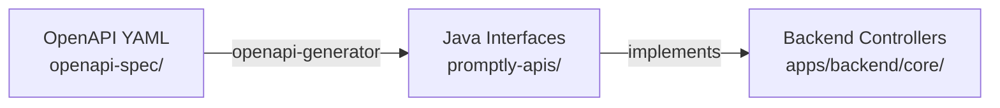

# Promptly APIs — Generated Server Interfaces

<p align="center">
  
  
  
</p>

---

## Overview

This module contains **auto-generated Java interfaces** from the Promptly OpenAPI specification. These interfaces define the REST API contract and are implemented by the backend controllers.

> ⚠️ **Do not edit files in this module manually.** They are regenerated from the OpenAPI spec.

## How It Works



1. The **OpenAPI specification** lives in `libs/shared/openapi-spec/`
2. Running `pnpm run build:openapi` generates this module
3. Backend controllers **implement** these interfaces to ensure contract compliance

## Usage

Add the dependency to your Spring Boot module:

```xml
<dependency>
  <groupId>com.promptly</groupId>
  <artifactId>promptly-apis</artifactId>
  <version>${project.version}</version>
</dependency>
```

Then implement the generated interface in your controller:

```java
@RestController
public class PromptController implements PromptsApi {
    // Implement all methods defined in the OpenAPI spec
}
```

## Regeneration

```bash
# From the monorepo root
pnpm run build:openapi

# Or with Maven directly
mvn generate-sources -f libs/shared/openapi-spec/pom.xml
```

---

## Related

- [OpenAPI Spec](../../openapi-spec) — the source YAML specification
- [Angular SDK](../../sdks/v1/angular/promptly-client) — generated Angular client
- [TypeScript SDK](../../sdks/v1/query/typescript/promptly-query) — generated TypeScript (Fetch) client
- [Python SDK](../../sdks/v1/query/python/promptly-query) — generated Python client
- [Java Query SDK](../../sdks/v1/query/java-spring/promptly-query) — generated Java WebClient SDK
- [Main README](../../../../../README.md) — project overview

---

<p align="center">
  Part of the <a href="https://github.com/spectrayan/promptly">Promptly</a> platform · Auto-generated by <a href="https://openapi-generator.tech">OpenAPI Generator</a>
</p>
